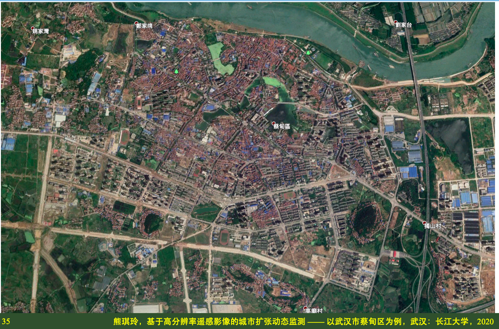
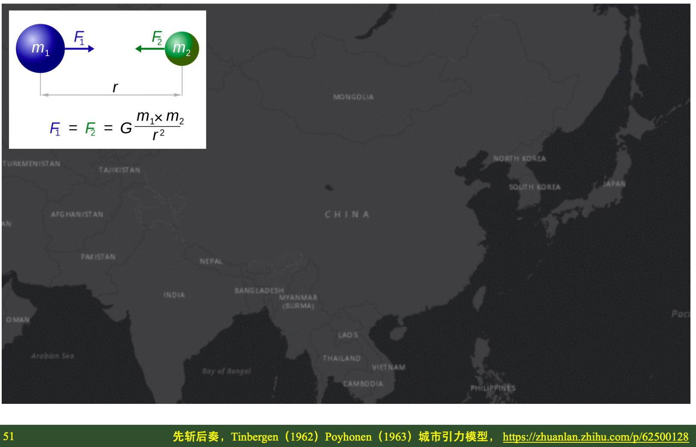
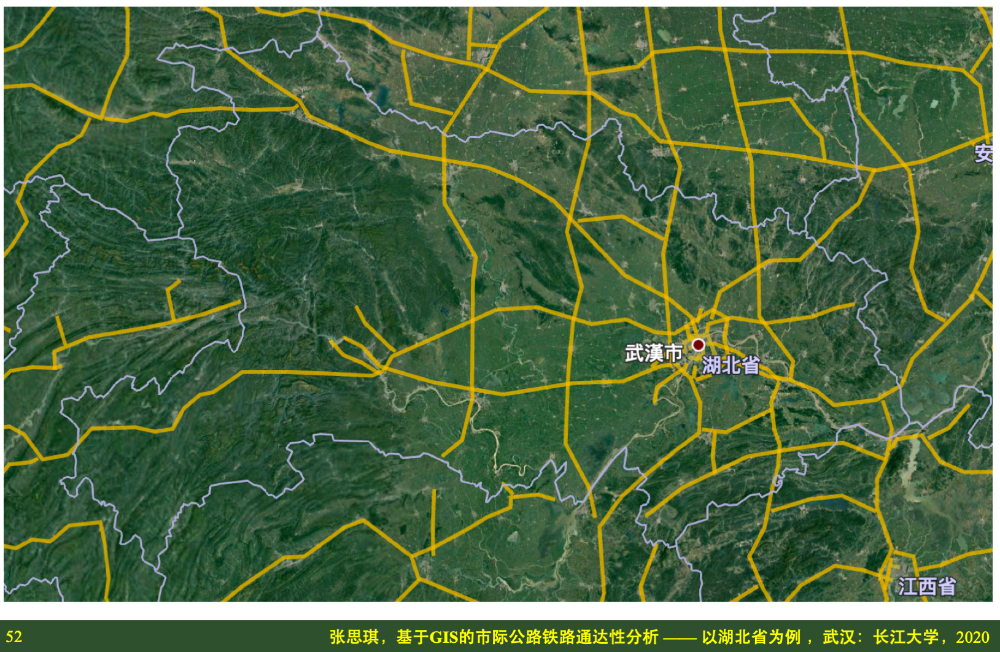

# 2020届本科毕业设计

长江大学地球科学学院地理信息系

<html>
    <head>
    <style>
        #chartdiv {
            width: 100%;
            height: 480px;
        }
        .map-marker {
            margin-left: -5px;
            margin-top: -5px;
        }
        .map-marker.map-clickable {
            cursor: pointer;
        }
        .pulse {
            width: 0px;
            height: 0px;
            border: 0px solid #f7f14c;
            -webkit-border-radius: 30px;
            -moz-border-radius: 30px;
            border-radius: 30px;
            background-color: #716f42;
            z-index: 10;
            position: absolute;
      }
      .map-marker .dot {
            border: 10px solid #FFFFFF;
            background: transparent;
            -webkit-border-radius: 100px;
            -moz-border-radius: 100px;
            border-radius: 100px;
            height: 40px;
            width: 40px;
            -webkit-animation: pulse 0.5s ease-out;
            -moz-animation: pulse 1s ease-out;
            animation: pulse 1.5s ease-out;
            -webkit-animation-iteration-count: infinite;
            -moz-animation-iteration-count: infinite;
            animation-iteration-count: infinite;
            position: absolute;
            top: -25px;
            left: -25px;
            z-index: 1;
            opacity: 0;
    }
    @-moz-keyframes pulse {
           0% {
              -moz-transform: scale(0);
              opacity: 0.0;
           }
           25% {
              -moz-transform: scale(0);
              opacity: 0.1;
           }
           50% {
              -moz-transform: scale(0.1);
              opacity: 0.3;
           }
           75% {
              -moz-transform: scale(0.5);
              opacity: 0.5;
           }
           100% {
              -moz-transform: scale(1);
              opacity: 0.0;
           }
    }
    @-webkit-keyframes "pulse" {
           0% {
              -webkit-transform: scale(0);
              opacity: 0.0;
           }
           25% {
              -webkit-transform: scale(0);
              opacity: 0.1;
           }
           50% {
              -webkit-transform: scale(0.1);
              opacity: 0.3;
           }
           75% {
              -webkit-transform: scale(0.5);
              opacity: 0.5;
           }
           100% {
              -webkit-transform: scale(1);
              opacity: 0.0;
           }
       }
    </style>
    </head>
    <body>
    <script src="https://www.amcharts.com/lib/3/ammap.js"></script>
    <script src="https://www.amcharts.com/lib/3/maps/js/worldLow.js"></script>
    <script src="https://www.amcharts.com/lib/3/themes/light.js"></script>
    <script>
    var targetSVG = "M9,0C4.029,0,0,4.029,0,9s4.029,9,9,9s9-4.029,9-9S13.971,0,9,0z M9,15.93 c-3.83,0-6.93-3.1-6.93-6.93S5.17,2.07,9,2.07s6.93,3.1,6.93,6.93S12.83,15.93,9,15.93 M12.5,9c0,1.933-1.567,3.5-3.5,3.5S5.5,10.933,5.5,9S7.067,5.5,9,5.5 S12.5,7.067,12.5,9z";

    <!-- var targetSVG = "{{site.baseurl}}/assets/svg/taxi.svg"; -->

    var map = AmCharts.makeChart( "chartdiv", {
        "type": "map",
        "theme": "light",
        "dragMap": true,
        "projection": "miller",
        "mouseWheelZoomEnabled": true,
        "showBalloonOnSelectedObject": true,
        "backgroundAlpha": 1,
        "backgroundColor": "#000",

        "dataProvider": {
            "mapURL": "/assets/map/chinaHigh.svg",

            "zoomLevel": 3,
            "zoomLatitude": 28.69,
            "zoomLongitude": 112.66,

            "lines": [
            { "arc": -0.85, "id": "line1", "latitudes": [ 30.45, 29.99], "longitudes": [ 111.73, 112.66]},
            { "arc": -0.6, "id": "line2", "latitudes": [ 26.35, 29.99], "longitudes": [ 106.42, 112.66]},
            { "arc": 0.85, "id": "line3", "latitudes": [ 30.35, 29.99], "longitudes": [ 114.17, 112.66]}
            ],


            "images": [
            {"type": "circle", "title": "<b>湖北荆州</b><br/>方小地", "latitude": 29.99, "longitude": 112.66, "color": "#FFFF00", "scale": 1.0},
            {"type": "circle", "title": "<b>湖北宜昌</b><br/>熊小玲", "latitude": 30.45, "longitude": 111.73, "color": "#FF00FF", "scale": 0.8},
            {"type": "circle", "title": "<b>贵州贵阳</b><br/>严小信", "latitude": 26.35, "longitude": 106.42, "color": "#FF00FF", "scale": 0.8},
            {"type": "circle", "title": "<b>湖北武汉</b><br/>张小琪", "latitude": 30.35, "longitude": 114.17, "color": "#FF00FF", "scale": 0.8}
            ]
        },

            "areasSettings": {
                "color": "#FFCC00",
                "outlineThickness": 0.3,
                "unlistedAreasColor": "#FFFFFF",
                "unlistedAreasAlpha": 0.6
            },

            "imagesSettings": {
              "color": "#000000",
              "rollOverColor": "#FFFF00",
              "selectedColor": "#000000"
            },

            "linesSettings": {
              "arc": -0.75,
              "arrow": "middle",
              "color": "#00FF00",
              "alpha": 1,
              "arrowAlpha": 1,
              "arrowSize": 3,
              "thickness": 1
            },

            "balloon": {
                "drop": false,
                "fixedPosition": false
            },

            "zoomControl": {
              "homeButtonEnabled": false,
              "zoomControlEnabled": false,
              "buttonSize": 10,
              "gridHeight": 0,
              "draggerAlpha": 0,
              "gridAlpha": 0
            },

            "backgroundZoomsToTop": true,
            "linesAboveImages": false,

           "export": {
             "enabled": false
           }
    } );

    map.addListener( "positionChanged", updateCustomMarkers );

    function updateCustomMarkers( event ) {
      var map = event.chart;

      for ( var x in map.dataProvider.images ) {
        var image = map.dataProvider.images[ x ];
        if (x == 4) {
            if ( 'undefined' == typeof image.externalElement )
            image.externalElement = createCustomMarker( image );
            var xy = map.coordinatesToStageXY( image.longitude, image.latitude );
            image.externalElement.style.top = xy.y + 'px';
            image.externalElement.style.left = xy.x + 'px';
        } else {
            if ( 'undefined' == typeof image.externalElement )
            image.externalElement = createCustomMarker( image );
            var xy = map.coordinatesToStageXY( image.longitude, image.latitude );
            image.externalElement.style.top = xy.y + 'px';
            image.externalElement.style.left = xy.x + 'px';
        }
      }
    }

    function createCustomMarker( image ) {
      var holder = document.createElement( 'div' );
      holder.className = 'map-marker';
      holder.title = image.title;
      holder.style.position = 'absolute';

      if ( undefined != image.url ) {
        holder.onclick = function() {
          window.location.href = image.url;
        };
        holder.className += ' map-clickable';
      }

      var dot = document.createElement( 'div' );
      dot.className = 'dot';
      holder.appendChild( dot );

      var pulse = document.createElement( 'div' );
      pulse.className = 'pulse';
      holder.appendChild( pulse );

      image.chart.chartDiv.appendChild( holder );

      return holder;
    }


    </script>
    </body>
    <div id="chartdiv"></div>
</html>


## 目录
{:.no_toc}
1. TOC
{:toc}

## 20191101 选题申报
选题一：遥感影像处理

基于高分辨率遥感影像的城市扩张动态监测 —— 以武汉市蔡甸区为例

一句话：从遥感影像上看城市是怎么一步步长成今天这个样子的

毕设突出展示：
1. 遥感影像处理技术提取城市不透水面
2. 地理信息系统展示空间格局演变过程

研究区域：武汉市蔡甸区主城区（以行政边界为准）
数据来源：高分辨率Google影像
时间区间：2010-2019年多期影像（每年一期、每两年一期、或者每五年一期）

主要内容：
1. 数据收集：获取高分遥感影像（Google影像下载）
2. 数据预处理：校正、裁剪、以道路街区为单位进行分析
3. 数据分析：提取城市不透水面（建筑物、道路）、空间格局统计与分析
4. 结果讨论：城市扩张模式的驱动力简要分析（发展政策）
5. 展示平台：简易展示城市扩张的动态过程

***

选题二：GIS网络分析

基于GIS的市际公路铁路通达性分析 —— 以湖北省为例

一句话：从高速公路网和客运铁路网上看湖北省各个地级行政区之间的交通可达性

毕设突出展示：
1. 地理信息数据的获取、管理与分析
1. 空间分析之网络分析

研究区域：湖北省（以市政府所在位置表示城市区位）
数据来源：百度地图、高德地图（里程、平均时间）
时间区间：能搜集到的最新的时间点

主要内容：
1. 数据搜集：湖北省地级市位置分布图、高速公路网、客运铁路网
2. 数据预处理：Excel采集属性数据、距离与时间邻接矩阵
3. 数据分析：市际连通性（直线距离、公路距离、公路时间、铁路距离、铁路时间）
4. 结果讨论：市际连通图（如果不需要经过第三座城市就可直达，则连通，反之，则不连）
5. 展示平台：简单展示

***
选题三：数字地形分析
基于数字高程模型的江汉平原地形特征分析

一句话：从数字高程模型上看清江汉平原的高低起伏和空间范围

毕设突出展示：
1. 数字高程模型的处理、计算与分析
2. 数字地形分析

主要回答以下问题：
1. 江汉平原有多大：南抵长江，北抵哪里？
2. 江汉平原有多平：地形粗糙度，哪里最平？

研究区域：湖北省长江以北的区域
数据来源：国家基础地理信息中心 http://www.gscloud.cn

时间区间：任意

主要内容：
1. 数据搜集：湖北省长江以北的数字高程模型 90米空间分辨率的即可
2. 数据预处理：拼接、裁剪
3. 数据分析：高程分析、地形复杂度分析，找寻边界
4. 结果讨论：与现有基于行政区划的描述方式对比，本研究的意义
5. 展示平台：简单展示

***
选题四：历史GIS应用

基于GIS的湖北省行政区划历史沿革研究

一句话：从历朝历代的中国历史地图上看湖北地区的行政区划沿革情况

毕设突出展示：
1. 历史GIS
2. 地图编绘与空间分析

研究区域：湖北省现行行政区域范围（以此为基准）
数据来源：中国历史地图集
时间区间：原始社会至今

主要内容：
1. 数据搜集：中国历史地图集（谭其骧）、中国县级行政区划数据（国家基础地理信息）
2. 数据预处理：几何校正、数字化、属性录入与管理
3. 数据分析：关注湖北省历朝历代的行政区划严格（行政中心迁移、边界范围变化等）
4. 结果讨论：探讨GIS在历史研究中的意义
5. 展示平台：历史GIS

## 20191120 学生选题

```
工作安排：
第9-10周（10月28日-11月8日）学院组织审核指导教师资格以及指导老师申报毕业设计题目(院内、院外)

第11-12周（11月11日-11月22日) 由指导教师填写“课题申报、审核表”，经系、学院两级审核后，上交教学办，确定课题。
```

2019年11月20日

指导老师：方小地 讲师
申报题目：3项

1. 基于高分辨率遥感影像的城市扩张动态监测 —— 以武汉市蔡甸区为例
2. 基于GIS的市际公路铁路通达性分析 —— 以湖北省为例
3. 基于GIS的湖北省行政区划历史沿革研究

```
工作安排
第13周（11月25日-11月29日） 召开全院毕业设计动员大会，实施学生与指导教师双向选择。落实合作指导企业导师，完成选题工作。
```

2019年11月28日 完成选题工作
1. 选题一：熊小玲 201600454 地信21602
2. 选题二：张小琪 201600462 地信（产业）21601
3. 选题三：严小信 201600458 地信21602


## 20191206 下任务书
```
第14周（12月2日-12月6日 指导老师填写任务书，向学生下达任务书。
```

两张图：
1. 收集整理资料、数据、文献（研究区域图）
2. 设计研究技术路线（数据流程图）
3. **避免无畏的付出，首先要看看能直接获得的资料有什么**

任务书
S1 熊小玲
基于高分辨率遥感影像的城市扩张动态监测 —— 以武汉市蔡甸区为例

1. 遥感影像：遥感影像下载 链接: https://pan.baidu.com/s/1b-LM4FKAB3lMuzZWZ2lUOA 提取码: dqui
2. 底图数据：要找个标准地图作为几何精细校正的参考 国家基础地理信息中心标准地图 http://bzdt.ch.mnr.gov.cn
3. 文献资料：面向对象影像分析 + 城市扩张理论
4. 统计资料：湖北省统计局有关蔡甸城区人口、经济等指标

T1 城市扩张


***
S2 张小琪
基于GIS的市际公路铁路通达性分析 —— 以湖北省为例

1. 地图数据：国家基础地理信息中心标准地图 http://bzdt.ch.mnr.gov.cn
2. 文献资料：交通网络通达性 + 城市引力模型 + 高德地图路径规划
3. 统计资料：湖北省统计局有关各地级市人口、经济等指标

T2 空间通达



***
S3 严小信
基于GIS的湖北省行政区划历史沿革研究

1. 地图数据：谭其骧《中国历史地图集》 链接: https://pan.baidu.com/s/1X6iGanCrmOz1eAMyo9YYHg 提取码: ampv
2. 公开数据：复旦大学历史地理研究中心CHGIS数据 http://yugong.fudan.edu.cn/index.php （先看看这个数据集能不能用，可能不需要再数字化）
3. 底图数据：国家基础地理信息中心标准地图 http://bzdt.ch.mnr.gov.cn
4. 文献资料：中国历史 + 地图数字化 + 地理信息系统

T3 时空变迁


## 20200216 开题报告

```
工作安排：

第15-18周（12月9日-2019年1月3日）指导教师督促学生做好文献检索，外文阅读与翻译，文献综述；撰写完成开题报告（详细要求见学生工作手册第10页）。

第19周（2020年1月6日-2020年1月10日）学生向指导老师提交开题报告，分系或学科组进行开题答辩并由答辩小组秘书做好答辩记录。
```

2019年12月24日 工作内容：
1. 开题报告（模板见2020届毕设小分队QQ群共享）
2. 开题答辩PPT

S1 熊小玲
基于高分辨率遥感影像的城市扩张动态监测 —— 以武汉市蔡甸区为例

S2 张小琪
基于GIS的市际公路铁路通达性分析 —— 以湖北省为例

S3 严小信
基于GIS的湖北省行政区划历史沿革研究

## 20200216 外文翻译
```
选题学生

依据毕业设计选题，选择一篇英文文献进行翻译。翻译稿随开题报告一并提交。

外文翻译：外文翻译要求准确、流畅，内容包括：标题，标题下方正中为外文作者名、译者名（格式：× × ×著，× × ×译），外文翻译成中文的内容。
```

熊小玲的译文

张小琪的译文

严小信的译文
Chiang, Tao-Chang, 2005. Historical geography in China. *Progress in Human Geography*, 29(2), pp.148–164. [https://doi.org/10.1191/0309132505ph537oa](https://doi.org/10.1191/0309132505ph537oa).
姜道章，2005. 中国历史地理学. *人文地理学进展*. 第29卷，第2期，页码：148-164.
```
姜道章（1929年- ），中国文化大学地理系教授。
```
