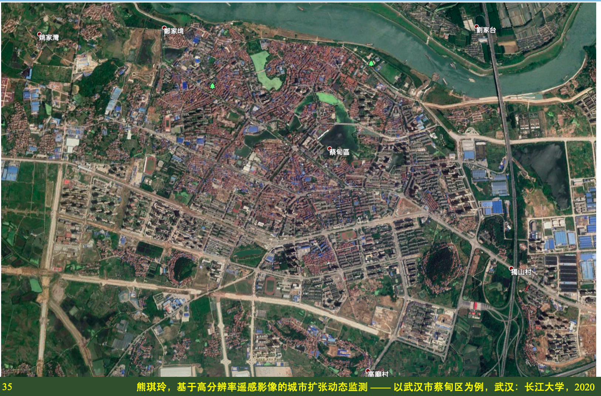
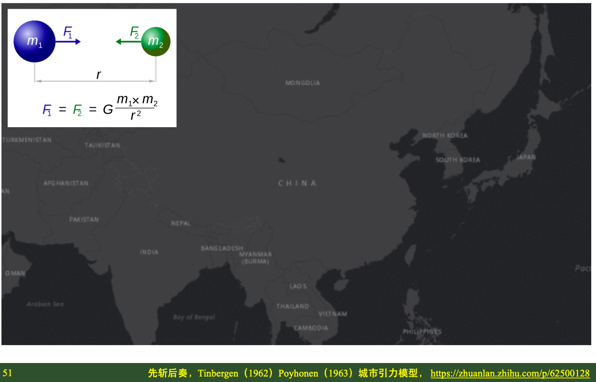
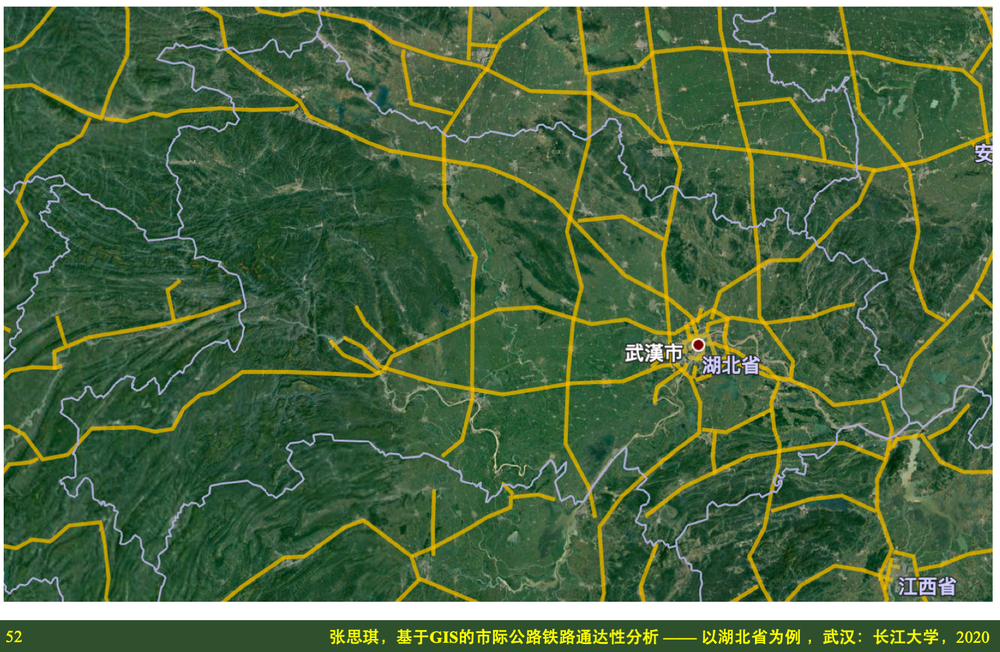
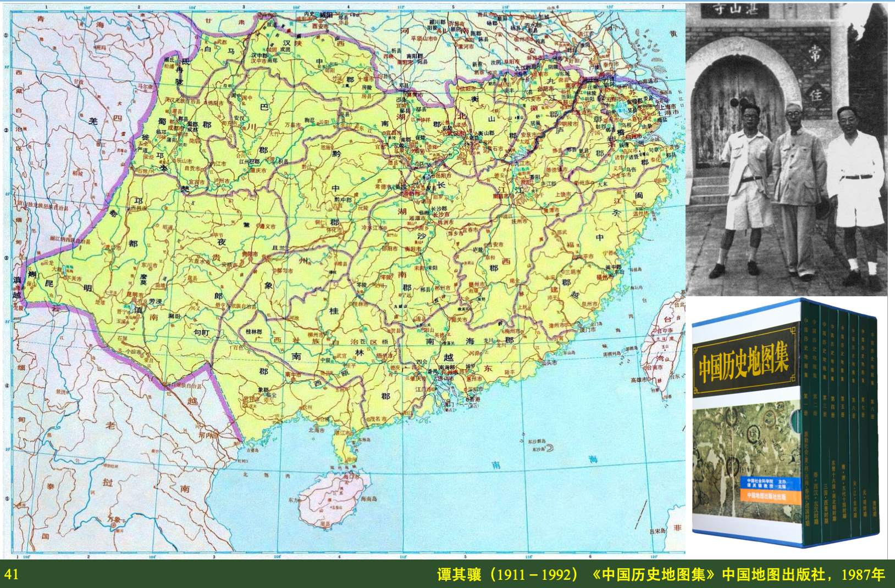
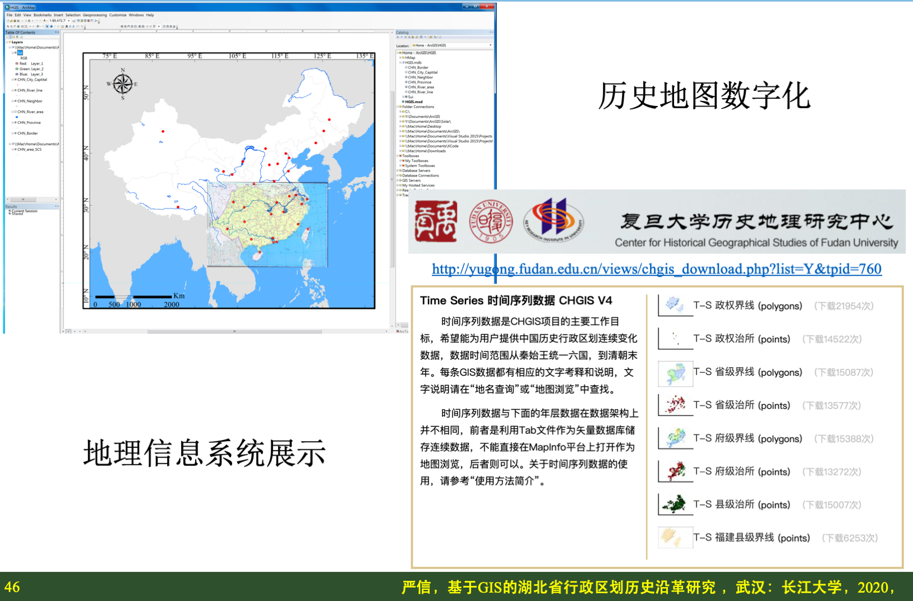
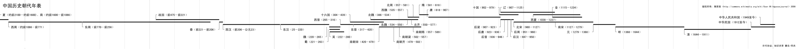

[toc]


# 2020届本科毕业设计选题

长江大学地球科学学院地理信息科学系

## 指导老师申报毕设题目
```
工作安排：
第9-10周（10月28日-11月8日）学院组织审核指导教师资格以及指导老师申报毕业设计题目(院内、院外)

第11-12周（11月11日-11月22日) 由指导教师填写“课题申报、审核表”，经系、学院两级审核后，上交教学办，确定课题。
```

2019年11月20日

指导老师：张方利 讲师
申报题目：3项

1. 基于高分辨率遥感影像的城市扩张动态监测 —— 以武汉市蔡甸区为例
2. 基于GIS的市际公路铁路通达性分析 —— 以湖北省为例
3. 基于GIS的湖北省行政区划历史沿革研究

```
工作安排
第13周（11月25日-11月29日） 召开全院毕业设计动员大会，实施学生与指导教师双向选择。落实合作指导企业导师，完成选题工作。
```

2019年11月28日
完成选题工作
1. 选题一：熊琪玲 201600454 地信21602
2. 选题二：张思琪 201600462 地信（产业）21601
3. 选题三：严信 201600458 地信21602

## 指导老师下达任务书
```
第14周（12月2日-12月6日 指导老师填写任务书，向学生下达任务书。
```

两张图：
1. 收集整理资料、数据、文献（研究区域图）
2. 设计研究技术路线（数据流程图）
3. **避免无畏的付出，首先要看看能直接获得的资料有什么**

### S1 熊琪玲
基于高分辨率遥感影像的城市扩张动态监测 —— 以武汉市蔡甸区为例

1. 遥感影像：遥感影像下载 链接: https://pan.baidu.com/s/1b-LM4FKAB3lMuzZWZ2lUOA 提取码: dqui
2. 底图数据：要找个标准地图作为几何精细校正的参考 国家基础地理信息中心标准地图 http://bzdt.ch.mnr.gov.cn
3. 文献资料：面向对象影像分析 + 城市扩张理论
4. 统计资料：湖北省统计局有关蔡甸城区人口、经济等指标


### S2 张思琪
基于GIS的市际公路铁路通达性分析 —— 以湖北省为例

1. 地图数据：国家基础地理信息中心标准地图 http://bzdt.ch.mnr.gov.cn
2. 文献资料：交通网络通达性 + 城市引力模型 + 高德地图路径规划
3. 统计资料：湖北省统计局有关各地级市人口、经济等指标

### S3 严信
基于GIS的湖北省行政区划历史沿革研究

1. 地图数据：谭其骧《中国历史地图集》 链接: https://pan.baidu.com/s/1X6iGanCrmOz1eAMyo9YYHg 提取码: ampv
2. 公开数据：复旦大学历史地理研究中心CHGIS数据 http://yugong.fudan.edu.cn/index.php （先看看这个数据集能不能用，可能不需要再数字化）
3. 底图数据：国家基础地理信息中心标准地图 http://bzdt.ch.mnr.gov.cn
4. 文献资料：中国历史 + 地图数字化 + 地理信息系统


## 毕业设计总体思路
### T1 城市扩张




### T2 空间通达



### T3 时空变迁



