# 2019-2020学年第2学期C语言程序设计课程

长江大学地球科学学院地信系

## 目录
{:.no_toc}
1. TOC
{:toc}


## 方小地和他的小伙伴们

地信（测绘）21901 31人
地信（测绘）21902 30人

<html>
    <head>
    <style>
        #chartdiv {
            width: 100%;
            height: 480px;
        }
        .map-marker {
            margin-left: -5px;
            margin-top: -5px;
        }
        .map-marker.map-clickable {
            cursor: pointer;
        }
        .pulse {
            width: 0px;
            height: 0px;
            border: 0px solid #f7f14c;
            -webkit-border-radius: 30px;
            -moz-border-radius: 30px;
            border-radius: 30px;
            background-color: #716f42;
            z-index: 10;
            position: absolute;
      }
      .map-marker .dot {
            border: 10px solid #FFFFFF;
            background: transparent;
            -webkit-border-radius: 100px;
            -moz-border-radius: 100px;
            border-radius: 100px;
            height: 40px;
            width: 40px;
            -webkit-animation: pulse 0.5s ease-out;
            -moz-animation: pulse 1s ease-out;
            animation: pulse 1.5s ease-out;
            -webkit-animation-iteration-count: infinite;
            -moz-animation-iteration-count: infinite;
            animation-iteration-count: infinite;
            position: absolute;
            top: -25px;
            left: -25px;
            z-index: 1;
            opacity: 0;
    }
    @-moz-keyframes pulse {
           0% {
              -moz-transform: scale(0);
              opacity: 0.0;
           }
           25% {
              -moz-transform: scale(0);
              opacity: 0.1;
           }
           50% {
              -moz-transform: scale(0.1);
              opacity: 0.3;
           }
           75% {
              -moz-transform: scale(0.5);
              opacity: 0.5;
           }
           100% {
              -moz-transform: scale(1);
              opacity: 0.0;
           }
    }
    @-webkit-keyframes "pulse" {
           0% {
              -webkit-transform: scale(0);
              opacity: 0.0;
           }
           25% {
              -webkit-transform: scale(0);
              opacity: 0.1;
           }
           50% {
              -webkit-transform: scale(0.1);
              opacity: 0.3;
           }
           75% {
              -webkit-transform: scale(0.5);
              opacity: 0.5;
           }
           100% {
              -webkit-transform: scale(1);
              opacity: 0.0;
           }
       }
    </style>
    </head>
    <body>
    <script src="https://www.amcharts.com/lib/3/ammap.js"></script>
    <script src="https://www.amcharts.com/lib/3/maps/js/worldLow.js"></script>
    <script src="https://www.amcharts.com/lib/3/themes/light.js"></script>
    <script>
    var targetSVG = "M9,0C4.029,0,0,4.029,0,9s4.029,9,9,9s9-4.029,9-9S13.971,0,9,0z M9,15.93 c-3.83,0-6.93-3.1-6.93-6.93S5.17,2.07,9,2.07s6.93,3.1,6.93,6.93S12.83,15.93,9,15.93 M12.5,9c0,1.933-1.567,3.5-3.5,3.5S5.5,10.933,5.5,9S7.067,5.5,9,5.5 S12.5,7.067,12.5,9z";

    <!-- var targetSVG = "{{site.baseurl}}/assets/svg/taxi.svg"; -->

    var map = AmCharts.makeChart( "chartdiv", {
        "type": "map",
        "theme": "light",
        "dragMap": true,
        "projection": "miller",
        "mouseWheelZoomEnabled": true,
        "showBalloonOnSelectedObject": true,
        "backgroundAlpha": 1,
        "backgroundColor": "#000",

        "dataProvider": {
            "mapURL": "/assets/map/chinaHigh.svg",

            "zoomLevel": 1,
            "zoomLatitude": 36.7,
            "zoomLongitude": 104.2,

            "lines": [
            ],

            "images": [
            {"type": "circle", "title": "<b>湖北武汉 1</b><br/>孙睿康", "latitude": 30.35, "longitude": 114.17, "scale": 0.3},
            {"type": "circle", "title": "<b>湖北孝感 2</b><br/>艾&#12288筝<br/>付兴宽", "latitude": 30.92, "longitude": 113.91, "scale": 0.5},
            {"type": "circle", "title": "<b>湖北黄冈 5</b><br/>陈俊宇<br/>鲁子欣<br/>吴&#12288莹<br/>郭志辉<br/>张明敏", "latitude": 30.44, "longitude": 114.87, "scale": 0.8},
            {"type": "circle", "title": "<b>湖北恩施 3</b><br/>邓铭雪<br/>龙凌霄<br/>王铃淇", "latitude": 30.16, "longitude": 109.29, "scale": 0.5},
            {"type": "circle", "title": "<b>甘肃陇南 1</b><br/>侯莲霞", "latitude": 33.40, "longitude": 104.92, "scale": 0.3},
            {"type": "circle", "title": "<b>克拉玛依 1</b><br/>贾俊红", "latitude": 45.36, "longitude": 84.51, "scale": 0.3},
            {"type": "circle", "title": "<b>石河子 1</b><br/>林佳伟", "latitude": 44.18, "longitude": 86.00, "scale": 0.3},
            {"type": "circle", "title": "<b>库尔勒 1</b><br/>刘甜甜", "latitude": 41.46, "longitude": 86.07, "scale": 0.3},
            {"type": "circle", "title": "<b>河北邯郸 2</b><br/>蒋晓洁<br/>张子微", "latitude": 36.36, "longitude": 114.28, "scale": 0.4},
            {"type": "circle", "title": "<b>湖北黄石 1</b><br/>柯思琪", "latitude": 30.12, "longitude": 115.06, "scale": 0.3},
            {"type": "circle", "title": "<b>甘肃白银 1</b><br/>兰志玺", "latitude": 36.33, "longitude": 104.12, "scale": 0.3},
            {"type": "circle", "title": "<b>甘肃武威 1</b><br/>李奥杰", "latitude": 37.56, "longitude": 102.39, "scale": 0.3},
            {"type": "circle", "title": "<b>甘肃定西 1</b><br/>张金平", "latitude": 35.57, "longitude": 104.57, "scale": 0.3},
            {"type": "circle", "title": "<b>甘肃天水 1</b><br/>张婧怡", "latitude": 34.37, "longitude": 105.42, "scale": 0.3},
            {"type": "circle", "title": "<b>湖北十堰 5</b><br/>李启意<br/>叶&#12288青<br/>陆翔宇<br/>汤文惠<br/>周庆尧", "latitude": 32.40, "longitude": 110.47, "scale": 0.8},
            {"type": "circle", "title": "<b>河南洛阳 1</b><br/>李&#12288桥", "latitude": 34.41, "longitude": 112.27, "scale": 0.3},
            {"type": "circle", "title": "<b>河北保定 1</b><br/>梁亚琦", "latitude": 38.51, "longitude": 115.30, "scale": 0.3},
            {"type": "circle", "title": "<b>河北唐山 1</b><br/>朱&#12288浩", "latitude": 39.36, "longitude": 118.11, "scale": 0.3},
            {"type": "circle", "title": "<b>天津 3</b><br/>林&#12288权<br/>王辰宇<br/>张富铭", "latitude": 39.02, "longitude": 117.12, "scale": 0.5},
            {"type": "circle", "title": "<b>湖北宜昌 2</b><br/>林思奇<br/>张彦光", "latitude": 30.45, "longitude": 111.73, "scale": 0.4},
            {"type": "circle", "title": "<b>新疆博乐 1</b><br/>刘景洁", "latitude": 44.93, "longitude": 82.10, "scale": 0.3},
            {"type": "circle", "title": "<b>山东威海 1</b><br/>刘&#12288洋", "latitude": 37.50, "longitude": 122.10, "scale": 0.3},
            {"type": "circle", "title": "<b>辽宁抚顺 1</b><br/>娄兰贝宁", "latitude": 41.97, "longitude": 123.97, "scale": 0.3},
            {"type": "circle", "title": "<b>广西桂林 2</b><br/>陆鸿彬<br/>罗覃林", "latitude": 25.29, "longitude": 110.28, "scale": 0.4},
            {"type": "circle", "title": "<b>重庆 2</b><br/>彭&#12288真<br/>胡苛榆", "latitude": 29.35, "longitude": 106.33, "scale": 0.4},
            {"type": "circle", "title": "<b>山东临沂 3</b><br/>任友志<br/>陈馨媛<br/>文中冠", "latitude": 35.05, "longitude": 118.35, "scale": 0.5},
            {"type": "circle", "title": "<b>湖北钟祥 1</b><br/>王高寒", "latitude": 31.17, "longitude": 112.58, "scale": 0.3},
            {"type": "circle", "title": "<b>湖北咸宁 1</b><br/>黎博文", "latitude": 29.53, "longitude": 114.17, "scale": 0.3},
            {"type": "circle", "title": "<b>湖北荆州 3</b><br/>王倩莉<br/>陈筱颖<br/>王&#12288诚", "latitude": 30.33, "longitude": 112.23, "scale": 0.5},
            {"type": "circle", "title": "<b>江苏南京 1</b><br/>魏圆圆", "latitude": 32.05, "longitude": 118.78, "scale": 0.3},
            {"type": "circle", "title": "<b>河南南阳 2</b><br/>辛&#12288果<br/>张祯志", "latitude": 33.00, "longitude": 112.32, "scale": 0.4},
            {"type": "circle", "title": "<b>河南新乡 1</b><br/>荆怡迈", "latitude": 35.18, "longitude": 113.52, "scale": 0.3},
            {"type": "circle", "title": "<b>石家庄 1</b><br/>邢佳腾", "latitude": 38.02, "longitude": 114.3, "scale": 0.3},
            {"type": "circle", "title": "<b>广东东莞 1</b><br/>徐苑珊", "latitude": 23.02, "longitude": 113.45, "scale": 0.3},
            {"type": "circle", "title": "<b>广东茂名 1</b><br/>梁春辉", "latitude": 21.40, "longitude": 110.53, "scale": 0.3},
            {"type": "circle", "title": "<b>湖北随州 1</b><br/>杨可扬", "latitude": 31.42, "longitude": 113.22, "scale": 0.3},
            {"type": "circle", "title": "<b>云南德宏 1</b><br/>余章欧", "latitude": 24.50, "longitude": 97.80, "scale": 0.3},
            {"type": "circle", "title": "<b>山东菏泽 1</b><br/>张&#12288琼", "latitude": 35.14, "longitude": 115.26, "scale": 0.3},
            {"type": "circle", "title": "<b>湖北襄阳 1</b><br/>常&#12288帅", "latitude": 32.02, "longitude": 112.08, "scale": 0.3}
            ]
        },

            "areasSettings": {
                "color": "#FFCC00",
                "outlineThickness": 0.3,
                "unlistedAreasColor": "#FFFFFF",
                "unlistedAreasAlpha": 0.6
            },

            "imagesSettings": {
              "color": "#00FF00",
              "rollOverColor": "#FFFF00",
              "selectedColor": "#000000"
            },

            "linesSettings": {
              "arc": -0.75,
              "arrow": "middle",
              "color": "#FFFF00",
              "alpha": 1,
              "arrowAlpha": 1,
              "arrowSize": 3,
              "thickness": 1
            },

            "balloon": {
                "drop": false,
                "fixedPosition": false
            },

            "zoomControl": {
              "homeButtonEnabled": false,
              "zoomControlEnabled": false,
              "buttonSize": 10,
              "gridHeight": 0,
              "draggerAlpha": 0,
              "gridAlpha": 0
            },

            "backgroundZoomsToTop": true,
            "linesAboveImages": false,

           "export": {
             "enabled": false
           }
    } );

    map.addListener( "positionChanged", updateCustomMarkers );

    function updateCustomMarkers( event ) {
      var map = event.chart;

      for ( var x in map.dataProvider.images ) {
        var image = map.dataProvider.images[ x ];
        if (x == 4) {
            if ( 'undefined' == typeof image.externalElement )
            image.externalElement = createCustomMarker( image );
            var xy = map.coordinatesToStageXY( image.longitude, image.latitude );
            image.externalElement.style.top = xy.y + 'px';
            image.externalElement.style.left = xy.x + 'px';
        } else {
            if ( 'undefined' == typeof image.externalElement )
            image.externalElement = createCustomMarker( image );
            var xy = map.coordinatesToStageXY( image.longitude, image.latitude );
            image.externalElement.style.top = xy.y + 'px';
            image.externalElement.style.left = xy.x + 'px';
        }
      }
    }

    function createCustomMarker( image ) {
      var holder = document.createElement( 'div' );
      holder.className = 'map-marker';
      holder.title = image.title;
      holder.style.position = 'absolute';

      if ( undefined != image.url ) {
        holder.onclick = function() {
          window.location.href = image.url;
        };
        holder.className += ' map-clickable';
      }

      var dot = document.createElement( 'div' );
      dot.className = 'dot';
      holder.appendChild( dot );

      var pulse = document.createElement( 'div' );
      pulse.className = 'pulse';
      holder.appendChild( pulse );

      image.chart.chartDiv.appendChild( holder );

      return holder;
    }


    </script>
    </body>
    <div id="chartdiv"></div>
</html>


## 课程Q&A
### Q: 什么是计算机？
A: 计算机是人类发明的一种<span style="color:blue;">自动</span>机器，计算机的最基本功能是可以执行一组基本操作，每个操作完成一件很简单的计算工作，例如整数的加减乘除运算等等。为使计算机能按人的指挥工作，每种计算机都提供了一套指令，其中的每一种指令对应着计算机能执行的一个基本动作。

### Q: 什么是程序？
A: 程序通常指完成某些事务（把大象放进冰箱）的一种既定方式和过程（开冰箱门、赶大象、关冰箱门）。

### Q: 什么是编程？
A: 人们描述（编制）计算机程序的工作被称为程序设计或者编程，这种工作的产品就是程序。计算机是一种通用的计算机器，加上一个或一组程序后，它就会变为处理某个专门问题、完成某种特殊工作的专用机器。人与计算机交流的基本方式就是提供要求它执行的程序。在命令计算机去执行某个程序之 后，计算机就会按照程序的规定，一丝不苟地执行其中的指令，直至程序结束。

### Q: 怎么编程？
A: 学好<span style="color:blue;">程序设计语言</span>，熟悉程序运行环境，了解软件设计过程，然后应用来解决某个特定的问题。C语言就是本门课程介绍的一种高级程序设计语言，Visual Studio 2010就是这个程序的编写、编译和运行环境，后续课程——软件工程——会告诉大家怎么进行程序和软件设计，然后越来越多的专业课会告诉大家地理学领域有哪些问题等着大家用计算机去解决。

### Q: Visual Studio 2010是什么？
A: Visual Studio是微软（Microsoft）公司的集成开发环境（Integrated Development Environment，简称IDE），是一款辅助程序开发人员开发软件的应用软件，在开发工具内部就可以辅助编写源代码文本、并编译打包成为可用的程序。简而言之，就是你可以在里面编写源程序，然后编译成目标程序，连接成可执行应用程序，完成程序的编辑、编译、连接、执行一条龙服务，所以才叫“集成”的开发环境。
这其中，用来运行C语言程序的是Visual C++，可提供编辑C语言，C++以及C++/CLI等编程语言。当前最新的版本是Visual C++ 2019，曾经很经典的版本是Visual C++ 6.0（1998年8月），本门课程选用的是Visual C++ 2010（也即Visual C++ 10.0，2010年4月12日）。

### Q: 如何重置VS2010环境设置？
A: Visual Studio 2010程序界面，顶部菜单栏里选择“工具”-->“导入导出设置”，在弹出页面上寻选择“重置所有设置”，接着下一步，选择Visual C++开发设置，完成即可。

### Q: 沃斯公式是什么？
A: 算法（Algorithms） + 数据结构（Data Structures） = 程序（Programs）。尼古拉斯·沃斯（Niklaus Wirth, 1934年2月15日－）瑞士计算机学家，1976年以该公式为名著书，1984年获图灵奖。

### Q: 算法有哪些类型？
A: 算法分为<span style="color:blue;">数值运算算法</span>和<span style="color:blue;">非数值运算算法</span>
1. 数值运算的目的是求数值解。由于数值运算往往有现成的模型，可以运用数值分析方法，因此对数值运算的算法的研究比较深入，算法比较成熟。
2. 计算机在非数值运算方面的应用远超在数值运算方面的应用。非数值运算的种类繁多，要求各异，需要使用者参考已有的类似算法，重新设计解决特定问题的专门算法。

### Q: 如何判断闰年？
A: 四年一闰，百年不闰，四百年再闰。

### Q: 算法的特点有哪些？
A: 一个算法应当具有以下特点：
1. 有穷性：有限个步骤
2. 确定性：谢绝模糊
3. 有零个或多个输入：可以没有输入
4. 有一个或多个输出：不可以没有输出
5. 有效性：命令是可以执行且结果可控的

### Q: 结构化算法如何表示？
A: 以以下三种基本结构组合表示：
1. 顺序结构：运行一个子程序，然后运行下一个。
2. 选择结构：按布尔变量结果，决定运行两段子程序中的一段。
3. 循环结构：重复运行某子程序，直到特定布尔变量为真为止。


### Q: 如何设计结构化程序？
A: 采取以下方法保证得到结构化的程序：
1. 自顶向下；
2. 逐步细化；
3. 模块化设计；
4. 结构化编码。

### Q: 如何画传统流程图？
A: 先用自然语言分步骤对算法进行描述，然后：
1. 将步骤分解为各种类型
   1. 开始 -> 起止框 -> 圆角矩形
   2. 操作 -> 处理框 -> 直角矩形
   3. 条件 -> 判断框 -> 菱形框 + Y + N
   4. 结束 -> 起止框 -> 圆角矩形
2. 用带箭头的连线将框连接起来
   1. 先后顺序 -> 流程线 -> 带箭头的连线
   2. 检查菱形框所指向的选择或循环结构是否正确
   3. 检查菱形框内的条件是否有穷、确定、有效


### Q: 如何画N-S流程图？
A: 可由传统框线流程图转换而来：
1. 去除流程线
   1. 将带箭头的流程线去除
   2. 将需合并的处理框进行合并
   3. 将需拆解的处理框进行拆解

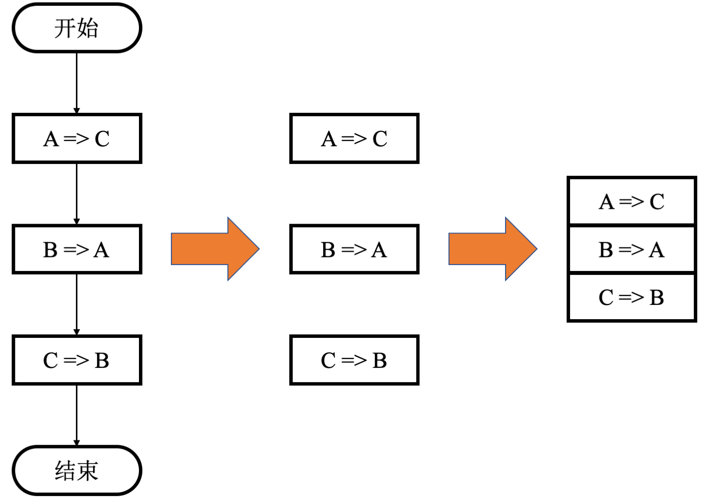
2. 框变矩形框
   1. 圆角矩形框可去除
   2. 矩形框继续保持矩形框
   3. 菱形框视条件变身
      1. 如果是选择结构
         1. 菱形框变成左、中、右三个三角形，组合成一个矩形
      2. 如果是循环结构
         1. 菱形框变成一个拐弯矩形，与循环结构的处理矩形框组合成一个矩形
            1. 如果是“当型”循环结构，拐弯矩形在上方
            2. 如果是“直到型”循环结构，拐弯矩形在下方

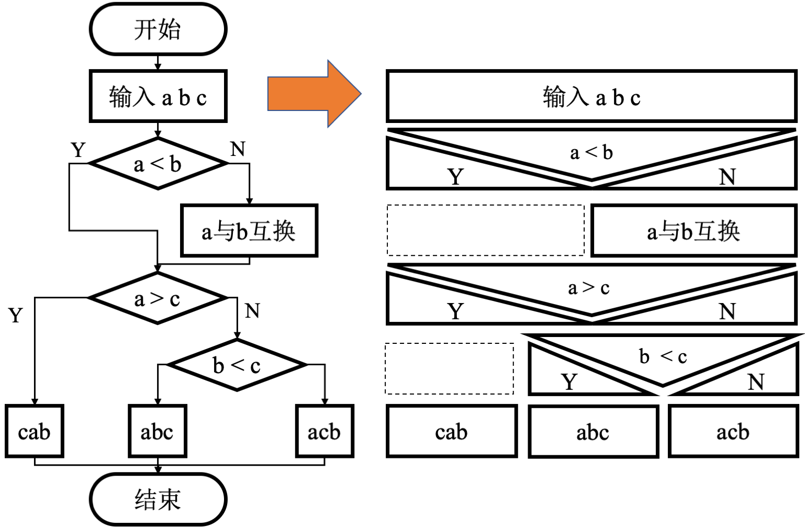
3. 空框补空白
   1. 菱形框变身后的左右两个三角形（Y, N），可能接下去没有处理框，需用空白框补齐
   2. 拐弯矩形的弯，要一直拐到循环结构内的所有操作命令处理完，可延伸

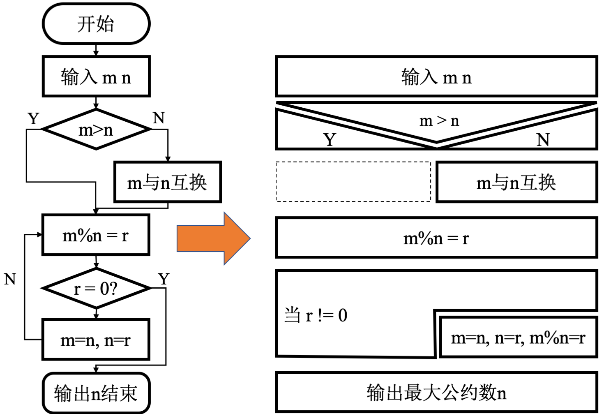

### Q: 如何理解常量、变量和常变量？
A: 用程序语言解释就是：
1. 常量就是“=”号右边的那些：
   1. 整型常量：整数，例如100
   2. 实型常量：小数，例如100.0
   3. 字符常量：符号，如\'!\'
   4. 转义字符：计算机可识别的命令符号，如\'\n\'
   5. 字符串常量：一串字符，如\"C Programming\"
   6. 符号常量：预定义符号，运行时被替换，如：
   ```c
   #include <stdio.h>
   #define PI 3.14159265358979323846
   int main()
   {
     return 0;
   }
   ```
2. 变量就是先定义，后使用，名称必须是合法标识符的那些：
   1. 整型变量：int a = 3, b; b = a;
   2. 浮点型变量：float a = 3.0f; double b = a;
   3. 字符型变量：char c = \'!\';
   4. 布尔型变量：C语言标准(C99) 没有定义布尔类型，使用时直接用0和1代替
3. 常变量就是不允许修改内容的变量：const int a = 3; 再a=4;会报错

### Q: 如何区分合法的标识符？
A: 三条准则：
1. 必须只能由字母、数字或下划线（\_）组成
2. 必须以字母或下划线（\_）开头
3. 不能与C语言关键字重复（大小写完全相同才算重复）

### Q: C语言关键字有哪些？
A: 多看几遍就脸熟了，用多了就知道了。

### Q: ASCII码怎么记？
A：理解就行，不需要记。记住三条：
1. 字符在计算机内部是以整数码（代码）的形式存在的
2. 我们看到的是?-!=(RS)，计算机做的是63-33 = 30
3. 屏幕上显示什么，是由printf函数控制的，%d输出整数码30，%c输出字符码(RS，Record Separator，记录分隔符)

### Q: 字符常量与字符串常量的区别？
A： 字符常量是单个字符，字符串常量可以是多个字符，定义、存储、使用的方式都不一样
1. 字符常量：\'C\'
   1. 单引号
   2. 单个字符
   3. 可以赋值给变量：char c = \'C\';
   4. 占用1个byte的存储空间：sizeof(char) = 1
2. 字符串常量：\"China!\"
   1. 双引号
   2. 可以多个字符
   3. 不可以直接赋值，可以用数组：char str[] = {\'C\',\'h\',\'i\',\'n\',\'a\',\'!\'}
   4. 占用n+1个byte的存储空间：sizeof(str) = 6+1 = 7
      1. 字符串作为数组存储时，需多一个byte存储结束符号\'\0\'

### Q: char a=\'1\'和int b=1的区别？
A: char是字符型变量，int是（有符号）基本整型变量：
1. a只是一个形状为1的符号，用来输出时才是1，用来计算时，其实等于49（查ASCII码），在计算机内占据1个byte的存储空间 sizeof(a) = 1
2. b是一个整数，输出时是1，计算时也是1，在计算机内（VS2010环境下）占用4个byte的存储空间，sizeof(b) = 4

```c
#include <stdio.h>
int main()
{
  char a = '1';
  int b = 1;

  printf("sizeof(a) = %d\n", sizeof(a));     //sizeof(a) = 1
  printf("sizeof(b) = %d\n", sizeof(b));     //sizeof(b) = 4

  printf("a = %c, b = %c\n", a, b);          //a = 1, b = 
  printf("a = %d, b = %d\n", a, b);          //a = 49, b = 1

  printf("a+a = %c, a+b = %c\n", a+a, a+b);  //a+a = b, a+b = 2
  printf("a+a = %d, a+b = %d\n", a+a, a+b);  //a+a = 98, a+b = 50

  printf("a-b = %c, b+b = %c\n", a-b, b+b);  //a-b = 0, b+b = 
  printf("a-b = %d, b+b = %d\n", a-b, b+b);  //a-b = 48, b+b = 2

  return 0;
}
```

### Q: 关于自增与自减运算符？
A：自增运算符（++）和自减运算符（--）都是单目运算符，其功能是让运算对象自增1或自减1，也即：
+ <span style="color:green;">++i</span>和<span style="color:green;">i++</span>，都相当于 i=i+1; 也相当于 i+=1;
+ <span style="color:green;">\-\-i</span>和<span style="color:green;">i\-\-</span>，都相当于 i=i-1; 也相当于 i-=1;

出现在运算对象的前后位置，分别意味着：
+ 运算对象（i）在后，运算符号（++）在前，如++i，则先做自增运算，再使用运算对象的值
+ 运算对象（i）在前，运算符号（++）在后，如i++，则后做自增运算，先使用运算对象的值


### Q: 强制类型转换？
A: <span id="Q1">强制类型转换</span>有两种形式：
+ 一种是人工干预的强制类型转换，其表达式形式为：(类型名)(表达式)，如(double)(3) = 3.000000
+ 一种是系统自动进行的自动类型转换，一般直接出现在表达式中，如5.0/3=5.0/3.0=1.666667
+ 这里面需要注意的有
  - (类型名)(表达式)中的表达式括号表示需要转换类型的对象，如果没有括号，则只转换紧跟着的那个数
    - (int)(3.1 + 2.9) = (int)(6) = 6
    - (int)3.1 + 2.9 = (int)(3.1) + 2.9 = 3 + 2.9 = 5.9
  - 取余运算符%的左右两侧只能是整数，浮点型无法通过类型转换计算出结果
    - <span style="color:green;">有效：</span>8%3=2
    - <span style="color:green;">有效：</span>(int)8.0%3=2
    - <span style="color:red;">无效：</span>(int)(8.0%3)=2
+ 表达式<span style="color:blue;">(int)((double)9/2)-(9)%2</span>的值是
  - 首先，(double)9对整型常量9进行了人工干预强制类型转换，变成双精度浮点型9.0L
  - 然后，9.0/2发生了系统自动类型转换，整型常量也被转作浮点型处理，9.0/2=9.0/2.0=4.5
  - 再然后，(int)(4.5)对浮点值4.5进行了人工干预强制类型转换，变成整型常量4
  - 再再然后，整型常量9对整型常量2取余，有效，结果为1
  - 最后，4-1
+ 结果是3

### Q: 给变量赋初值时的错误？
A: 变量需先定义，后使用。
+ 可以在定义时赋值：<span style="color:green;">int a=3;</span>
+ 可以在定义后赋值：<span style="color:green;">int a; a=3;</span>
+ 不能未定义就先使用：<span style="color:red;">int a=b=c=3;</span>程序会报错
  - 上述语句等同于int a; a=b=c=3;但因为b和c没有被定义，故不能使用。

### Q: scanf函数和printf函数？
A：scanf(\"<格式化字符串>\", <地址列表>);printf(\"<格式化字符串>\", <参量表>);
- 格式化字符串
  - %d 十进制有符号整数
  - %u 十进制无符号整数
  - %f 浮点数
  - %s 字符串
  - %c 单个字符
  - %p 指针的值
  - %e 指数形式的浮点数
  - %x, %X 无符号以十六进制表示的整数
  - %o 无符号以八进制表示的整数
  - %g 把输出的值按照 %e 或者 %f 类型中输出长度较小的方式输出
  - %p 输出地址符
  - %lu 32位无符号整数
  - %llu 64位无符号整数


```c
#include <stdio.h>
int main()
{
   char ch = 'A';
   char str[20] = "www.runoob.com";
   float flt = 10.234;
   int no = 150;
   double dbl = 20.123456;
   printf("字符为 %c \n", ch);
   printf("字符串为 %s \n" , str);
   printf("浮点数为 %f \n", flt);
   printf("整数为 %d\n" , no);
   printf("双精度值为 %lf \n", dbl);
   printf("八进制值为 %o \n", no);
   printf("十六进制值为 %x \n", no);

   int a,b,c;
   printf("请输入三个数字：");
   scanf("%d%d%d",&a,&b,&c);
   printf("%d,%d,%d\n",a,b,c);

   return 0;
}
```

### Q: 关系表达式的值？
A: 关系表达式，是用关系运算符将两个数值或数值表达式连接起来的式子，关系表达式的值是一个逻辑值，即“真”或“假”，在C的逻辑运算中，以“１”代表“真”，以“０”代表“假”。例如，若a=3，b=2，c=1，则：
+ d=a>b，由于a>b为真，因此关系表达式a>b的值为1，所以d=1。
+ f=a>b>c，则f的值为0。因为“>”运算符是自左至右的结合方向，先执行“a>b”得值为1， 再执行关系运算“1>c”，得值0，赋给f，所以f的值为0。

### Q: 关于作业HW4.2中的知识点？
A: <span id="Q2">课后作业HW4.2</span>中布置了三道作业题，包括2道必做题和1道选做题。延续了HW4.1的作业设置，反复练习，逐渐深化，希望帮助同学们巩固所学知识点，加深印象，提高编程技能。

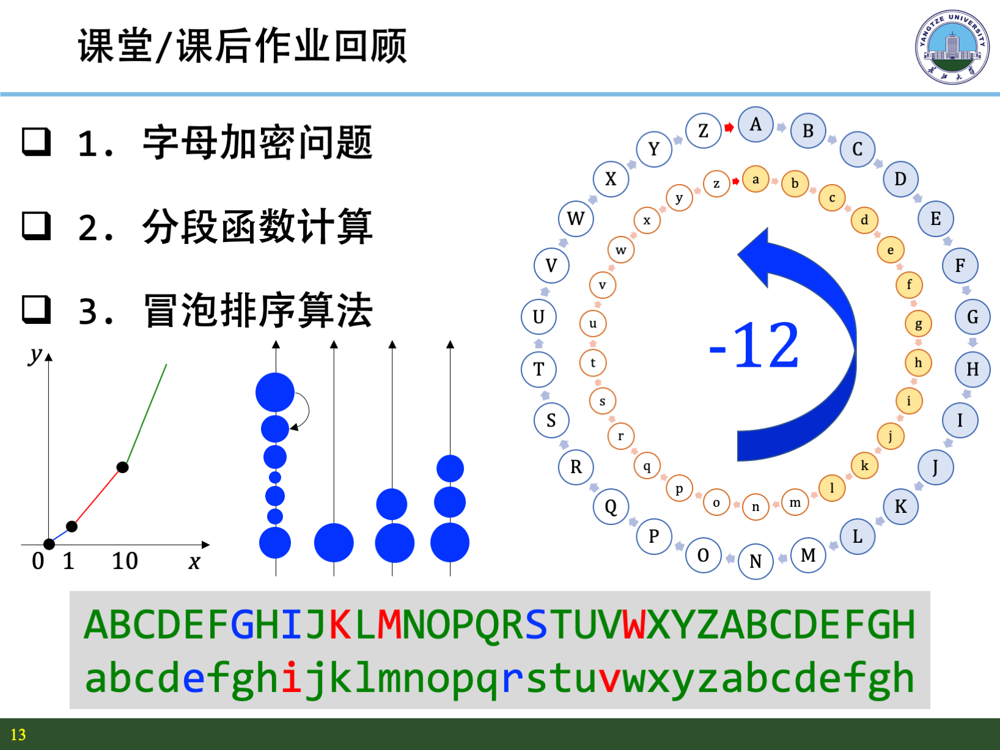

### Q: 当表达式中出现赋值表达式？
A：通常，在if(条件)的条件或表达式中，会出现只有一个等号的表达式，程序运行至此处时，会执行其中的赋值操作。有例题：设有<span style="color:green;">int a=1, b=2, c=0;</span>，试分析表达式(1)<span style="color:green;">(a=2)?b+a:c+a</span>和表达式(2)<span style="color:green;">a=2?b+a:c+a</span>的差别。分析如下，事实上：
+ 表达式(1)是一个条件表达式，等同于x?y:z，其中判断条件x相当于其中的(a=2)
+ 表达式(2)是一个赋值表达式，等同于m=x?y:z，也就是m=(x?y:z)，是把条件表达式的值赋值给m，这里x相当于其中的常量2，m就是等号左侧的整型变量a；
+ 究其原因，二者只有括号之差，是因为赋值运算符（=）的优先级低于条件运算符（?:），故而在没有括号的情况下，常量2优先与右侧的?b+a:c+a相结合，所以表达式(2)实际等同于<span style="color:green;">a=(2?b+a:c+a)</span>
+ 所以，表达式(1)的值为b+a=2+2=4，a是在条件中被赋值2的，表达式(1)的值为b+a=2+1=3，执行b+a时a还没有被赋值，而是条件表达式执行完后，将结果3赋值给了a。

### Q: C程序常见的错误有哪些？
1. 输入法类
   1. 不可以用中文
        1. 括号 是 \(\) 而不是（ ）
        2. 分号 是 ; 而不是 ；
        3. 冒号 是 \"\" 而不是 “”
        4. 建议是，尽可能用英文输入法，英文标点符号，毕竟编译环境是人家研发的。
   2. 除了以下情况，可以用中文
        1. 注释中的内容（<span style="color:green;">//注释</span> 和 <span style="color:green;">/\*注释\*/</span>）
        2. 字符串内部（char str[] =<span style="color:brown;">"我是一个字符串"</span>;）
        3. 格式化输出（printf(<span style="color:brown;">"输出一个字符串"</span>);）
1. 漏写了类
   1. 漏写了头文件 #include \<stdio.h>
   2. 漏写了头文件的后缀 #include \<stdio<span style="color:red;">.h</span>>
   3. 漏写了主函数 int main() {<span style="color:green;">/\*函数体\*/</span>}
   4. 漏写了主函数后的括号int main<span style="color:red;">( )</span>
   5. 漏写了自定义函数的事先声明 <span style="color:red;">int min(int x, int y);</span>
   6. 漏写了函数返回值，每个函数都至少有一个返回值，main函数也有 <span style="color:red;">return 0;</span>
1. 编译环境类
   1. 项目文档
      1. C程序的源文件后缀是\*.c，\*.cpp是C++程序的源文件后缀
      2. C程序的默认头文件是#include \<stdio.h>，C++程序的是#include \<iostream>
      3. C程序的主程序是int main()，如果自定义函数 int func()出现在main()后面要先声明
   2. Visual Studio 2010
      1. 新建项目（解决方案）时选择“Win32控制台应用程序”
      2. 新建文件（源文件）时选择“C++文件（\*.cpp）”，然后手动输入后缀"文件名.c"再保存
      3. C语言程序的主体框架永远是：
      ```c
      #include <stdio.h>
      //在这里添加内容
      int main()
      {
        //在这里添加内容
        return 0;
      }
      //在这里添加内容
      ```
1. 定义赋值类
   1. 赋值错误
      1. float r=7%; C语言不识别百分号表示的百分数，需用 float r=0.07;
   1. 变量未定义就使用
      1. <span style="color:red;">int a=b=c=3;</span> b和c未被定义就进行使用
      2. s = pi\*1.234\*1.234; pi需要定义并赋值后再使用
   2. 变量未赋值就使用
      1. int a, b, c=5; a = b; c被赋值5，但a和b都没赋值
2. 运算符号类
   1. 错用运算符号
      1. p=(1+r)^p 其中^符号是按位运算符号，不是求x的n次方运算符号，C语言中应使用pow(x, y)函数
      ```c
      #include <stdio.h>
      #include <math.h>
      int main()
      {
        float r = 0.07, p;
        p = pow((1+r),10);
        printf("p = %.2f\n", p);
        return 0;
      }
      ```
   2. 不合法的运算方式
      1. int a, b=0; a=3/b; 分母不能为0
      2. int a=8.0%3 取余运算符%两侧必须为整型
      3. int x, y; x=x+y=x; 取值运算符的左侧必须是可修改值的变量
         1. 可写成：x=x+(y=x);
         2. 相当于：y=x; x=x+y;
3. 输入输出类
   1. 格式化输入 scanf
      1. 漏写取地址符号：
         1. <span style="color:red;">错误：</span>scanf(\"%f, %f, %f\", a, b, c);
         2. <span style="color:green;">正确：</span>scanf(\"%f, %f, %f\", &a, &b, &c);
      2. 漏输附加字符：scanf(\"a=%f, b=%f, c=%f\", &a, &b, &c);
         1. <span style="color:red;">错误：</span>1 2 3回车
         2. <span style="color:red;">错误：</span>1,2,3回车
         3. <span style="color:red;">错误：</span>a=1 b=2 c=3回车
         4. <span style="color:green;">正确：</span>a=1,b=2,c=3回车
      3. 多输附加字符：scanf(\"%c%c%c\", &c1, &c2, &c3);
         1. <span style="color:red;">错误：</span>a b c回车（多输了空格）
         2. <span style="color:red;">错误：</span>a,b,c回车（多输了逗号）
         4. <span style="color:green;">正确：</span>abc回车
   2. 格式化输出 printf
      1. 漏写输出列表
         1. <span style="color:red;">错误：</span>printf(\"%d%d\", (int)a);
      2. 多写输出列表
         1. <span style="color:red;">错误：</span>printf(\"%d\", (int)a, (int)b);
      2. 格式控制与变量类型不一致
         1. <span style="color:red;">错误：</span>printf(\"%d\", (float)a);
         2. <span style="color:red;">错误：</span>printf(\"%f\", (int)a);
         3. <span style="color:red;">错误：</span>printf(\"%c\", 129);
   3. 单个字符输入 getchar
      1. getchar()函数不含输入参数，只有返回值，为char型，故赋值方式是 char a=getchar();而不能写成 getchar(&a);
   4. 单个字符输出 putchar
      1. putchar()函数有且只有一个输入参数，为char型，故调用方式为putchar(\'a\');
2. 判断条件类
   1. if...else 判断
      1. 错把逻辑表达式写成赋值语句
      ```c
      if(flag == 1) //当flag值为1时条件成立
      ```
      ```c
      if(flag = 1) //执行命令flag = 1
      ```
      2. 条件不互斥
      ```c
      if(a < b)
          {}
      else if (b < c)
          {}
      else
          {}
      ```
      3. if与else不配套
      ```c
        if(a < b)
            a++;
            b++;
        else
            a--;
      ```
      4. if(表达式)后加分号
      ```c
      if(a < b);
          a++;
      ```
   2. for 循环
      1. 局部变量
      ```c
      for(int i=1; i<10; i++){//C99新增可以在for循环条件语句中进行变量定义，但范围仅限循环体
        printf("%d\n", i); //局部变量合法使用范围
      }
      printf("%d\n", i); //不合法，i为未定义状态
      ```
   3. while 循环
      1. 复合语句需要用大括号括起来
      ```c
      while(i<10)
        printf("%d\n", i);
        i++;
      ```
   4. do...while 循环
      1. 漏了最后的分号
      ```c
      int i=0;
      do{
        printf("%d\n", i);
        i++;
      }while(i<=10); //这里的分号不能少，标志着while循环语句的结束
      ```
      2. 写错了while的条件，不是until
      ```c
      int i=0;
      do{
        printf("%d\n", i);
        i++;
      }while(i>10); //这里如果写i>10，那么执行完一次i=1时，判断条件为假，就结束了
      ```


## 授课日志
### 2020-02-06 雨课堂开课-长江大学教务处关联课程师生
地信（测绘）21901和21902两个班共61名同学绑定了课程。
### 2020-02-07 雨课堂测试-Visual Studio 2010安装教程
27/61名同学参与了测试，通信正常，院系领导旁听了测试。
### 2020-02-09 雨课堂试讲-C语言程序设计第一章绪论
36/61名同学参与了试讲，试讲了30分钟，通信正常，互动勉强。
### 2020-02-11 雨课堂上课-C语言程序设计第一章绪论
61/61名同学签到了课程，16:05-17:40，课程2节共90分钟，中途休息5分钟。

雨课堂统计，弹幕163条，PPT5次互动分别有55、56、53、50、49名同学参与，余心大慰。

雨课堂故障，全程音频直播大体平稳，17:30左右服务器开始出现故障，部分同学无法刷新页面，无法参与互动，直至课程结束。

个人感受：
1. 大一新生们的学习热情很能激励我，希望我能在接下来的教学过程中不断进步。
2. C语言程序设计的课程内容很适合网络教学，但仍希望在教室里进行互动和板书。
3. 雨课堂屏幕无法共享，激光笔无法使用，需要在PPT中多设计指示动画，随讲解过程一并播放。
4. 雨课堂对视频、GIF动图支持效果不友好，辅以微信群聊天后略有改善。
5. 雨课堂弹幕、微信群聊天出现的问题，如果进行实时回应，则容易中断讲课，若继续讲课，又影响学习效果，希望在接下来的教学过程中能切换自如。

### 2020-02-14 雨课堂上课-C语言程序设计第二章算法（1/2）
59/61名同学签到了课程，14:00-15:35，课程2节共90分钟，中途休息5分钟。

14:10，部分同学反映雨课堂无法连接上，全体移师腾讯课堂，59名同学通过腾讯课堂屏幕分享功能，观看了基于C语言在线编辑运行环境的演示，为大家实时演示了C语言程序的整体框架、基本结构、语法错误，示范了上一次课程的课后作业。

14:40，回到雨课堂。雨课堂统计，弹幕148条，全程PPT互动多次，有同学建议PPT互动时的习题，应该设置一个倒计时，让同学们知晓什么时候应该提交，这样就不会因为对答案犹豫不决而贻误了提交时机，余深以为然，自当改进。此外，网络环境下的雨课堂，也应该再稳定些才是。

### 2020-02-18 雨课堂上课-C语言程序设计第二章算法（2/2）
53/61名同学签到了课程，16:05-17:40，课程2节共90分钟，中途休息5分钟。

雨课堂持续崩溃中，15:55邀请同学们进入腾讯课堂，分享计算机屏幕，可自由播放PPT中的动画，也可自由切换到浏览器或IDE进行代码演示，很好用。同学们反映，雨课堂的唯一优势，就只剩下回放功能了。

课间休息5分钟后，雨课堂恢复，16:55和同学们一起转到雨课堂，开始第二小节课，五分钟后，陆续有同学反映无法刷新页面，或被挤出，应者众。不得已，再转回腾讯课堂，继续分享屏幕，直至课下。

全程演示顺利，同学们反映腾讯课堂更稳定，演示更有利于理解。只是可惜了，原本利用雨课堂设计的课堂小测试题，在腾讯课堂中只能借助答题卡工具，而无法直接获取每位同学各自的答题结果，不利于分析学习效果。

### 2020-02-21 雨课堂上课-C语言程序设计第三章顺序（1/3）
59/61名同学签到了课程，14:00-15:35，课程2节共90分钟，中途休息5分钟。

全程雨课堂授课，统计弹幕158条，PPT中6次随堂小测试均有45+同学参与。

同学反映，长时间的网络课程，频繁的科目切换，远程授课的非即时反馈，都给课程内容的跟进和理解造成了一定的困难。思来想去，唯有愿学生课前多预习，课后多练习，慕课多学习，作业多研习。接下来，课上希望多增加些知识点打磨环节。

课下，针对有同学表示没跟上课程内容，但又不知具体是哪里耽误了理解，特绘制如下图所示的知识点索引图，一来帮助同学加深理解，二来与同学们建立共同话语，方便问题索引，就地讨论，三来也可以帮助同学们预习复习，把所学内容串起来。

<!--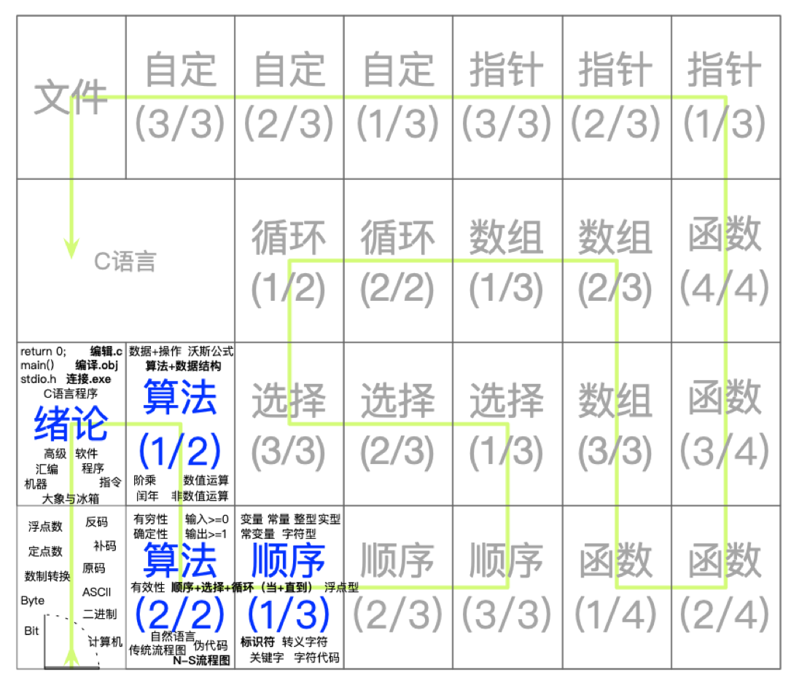-->

### 2020-02-25 雨课堂上课-C语言程序设计第三章顺序（2/3）
59/61名同学签到了课程，16:05-17:40，课程2节共90分钟，中途休息5分钟。

雨课堂新设长江雨课堂分中心，作为区域服务器缓解总服务器并发压力。课堂上：
1. 原总服务器上提交的课后作业，未能完全同步到长江雨课堂分中心上，一度以为是小伙伴们集体罢课了。
2. 新服务器增加了屏幕分享和视频直播功能，上课时久试不通，一直停留在测试计算机麦克风和摄像头上，延搁达十数分钟之久，心戚戚焉。
3. 雨课堂上课前五分钟，时而加载不上PPT，时而声音减弱，时而声音全无，时而雨课堂卡住不动，还好有微信群和同学们保持通信畅通，重启雨课堂两次后，逐渐正常，声音信号仍受影响。

本次课程改进有二：
1. 对于练习题，增加在线编码调试结果截图，方便课后自行练习。
2. 对于课后作业，进行详细讲解，有助于理解课程内容。

课上，同学们学习专注度有升，课程中间通过弹幕实时反馈知识点。针对本次课程的重点内容“强制类型转换”表达了疑问，课上及时根据例题重复讲解，未免有同学课上仍不明白，相关例题已被收录至本页面[Q&A版块](#Q1)。

课下，同学们学习热情见长，对着PPT中的例题和知识点很关注，提问很积极。

全程雨课堂授课，统计弹幕72条，PPT中包含8次练习题互动，本次课程仅测试6次，其余，留待下次课程修改答案后练习。
<!--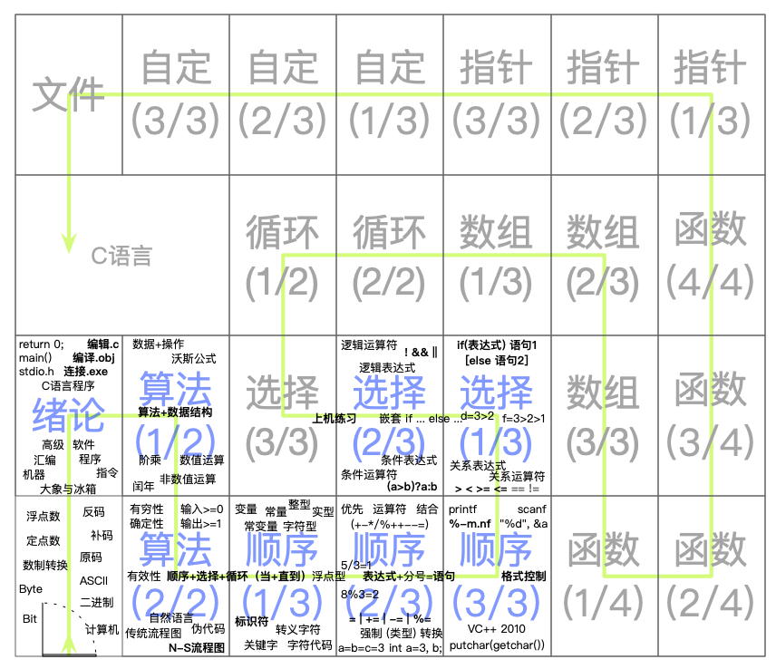-->

### 2020-02-28 雨课堂上课-C语言程序设计第三章顺序（3/3）
59/61名同学签到了课程，1名同学因为全程网络故障，另1名同学不知是何缘故。14:00-15:35，课程2节共90分钟，中途休息5分钟。

全程雨课堂授课，稳定无故障，统计弹幕158条，PPT中包含9次练习题互动，本次课程全部完成且进行了讲解，同学们参与度高，理解能力强，只是暂时对于C语言测试题的出题套路还没完全摸清，有待课后自行多加练习。
<!--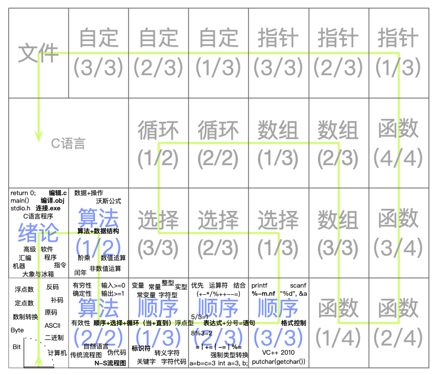-->

### 2020-03-03 雨课堂上课-C语言程序设计第四章选择（1/3）
59/61名同学签到了课程，16:05-17:40，课程2节共90分钟，中途休息5分钟。

X1 Carbon的音频和屏幕贡献功能仍然时不时故障，三次结束授课、三次重新开启授课，方才信号稳定，隐约发现，应该是账号登录的问题，建议多尝试退出登录后再重新登入。

全程雨课堂授课，稳定。

课间休息5分钟，计划利用雨课堂的屏幕分享功能为同学们演示Visual Studio 2010的基本操作，同学反映视频卡顿，课后另行录制屏幕视频，发送到课程群。

上次课后作业，出现了作业门事件，一时间没兜住，向学生表达了愤慨，事后冷静下来，甚是不安，所幸几位同学及时承认错误，主动前来沟通，顿时老泪纵横，热血盈眶，且看这新入职教师的热情，能保持到几时吧。

今次课堂，明显感受到同学们的参与度在提高，对于课件上不懂的或者有疑义的，及时通过弹幕发送，即时通过语音讲解，自觉效果不错。

<!--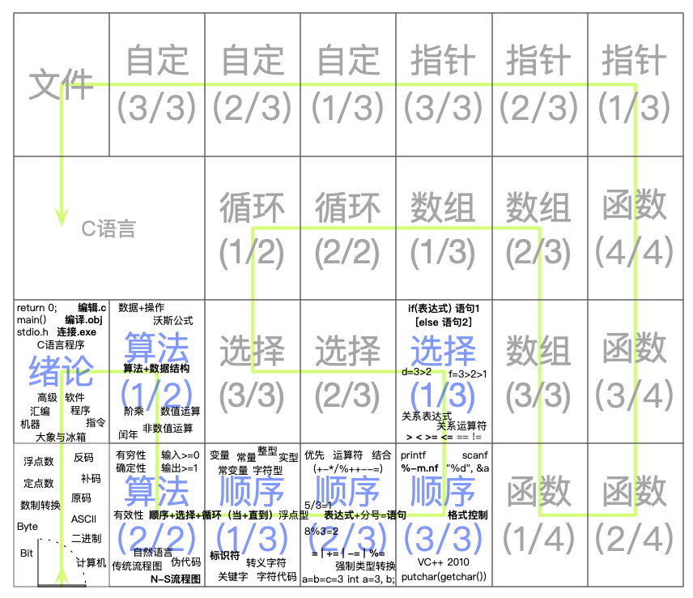-->

### 2020-03-06 雨课堂上课-C语言程序设计第四章选择（2/3）
58/61名同学签到了课程，14:00-15:40，课程2节共90分钟，中途休息5分钟。

全程雨课堂授课，稳定。

课间休息5分钟，发布了配套C语言程序设计52理论学时的20上机学时中前8个学时的任务，事实上上机的内容始终伴随着课程进行，同学们做练习和作业的过程中，就配套了Visual Studio 2010的安装、测试和代码运行测试。
+ 前四次上机安排如下
  - 20200219 上机1：熟悉编程环境（Visual Studio 2010）
  - 20200304 上机2：C语言的数据类型及输入输出（常量、变量、整型、字符型、浮点型、输入、输出等）
  - 20200311 上机3：C语言的运算符与表达式（算术、赋值、逗号、关系、逻辑、条件、求字节、强制类型转换运算符等）
  - 20200318 上机4：if语句和switch语句（if(表达式) ... else ...、switch(表达式) case 数值表达式: ...等）

课堂上，着重讲解课后作业，主要是考虑到大家花了较多的精力在作业上，不趁热加固，划不太来，索性直接把知识点揉进课后作业，在作业讲解的过程中复习知识点，例如[上次作业](#Q2)。

<!---->

### 2020-03-10 雨课堂上课-C语言程序设计第四章选择（3/3）
61/61名同学签到了课程，16:05-17:40，课程2节共90分钟，中途休息5分钟。

全程雨课堂授课，且是桌面屏幕分享直播，网络稳定，音质画质良好。

全程弹幕87条，同学们主要通过微信群发送课堂反馈。

今日次课程，所有的课堂测试题，增加一个E选项：我只是来看看，以搜集整理部分不知该如何作答的反馈，一来判断同学们的注意力是否在课堂上，二来也可以针对部分问题进行有针对性的讲解。

<!--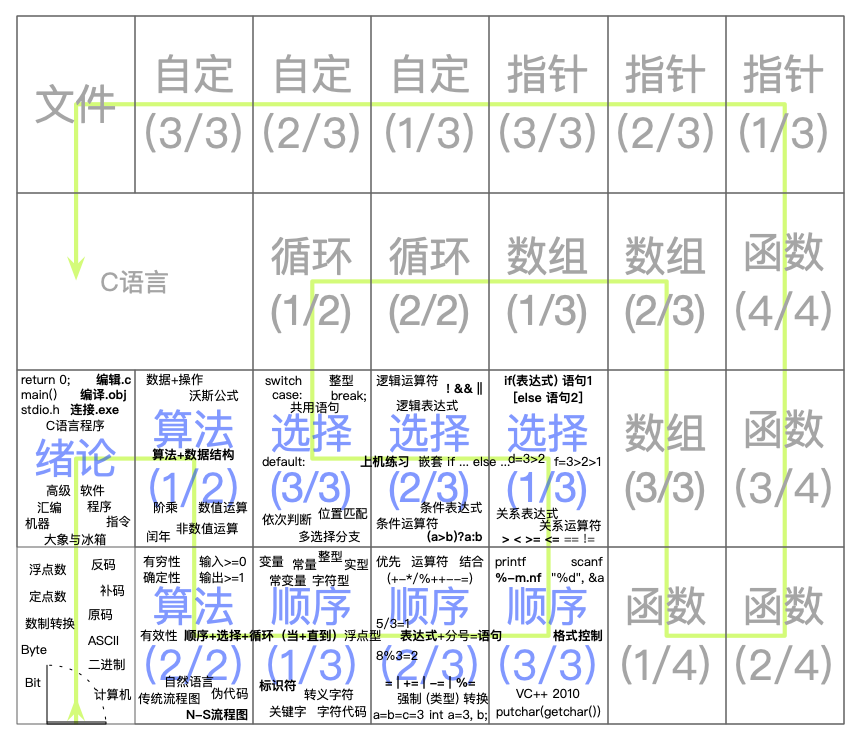-->


### 2020-03-13 雨课堂上课-C语言程序设计第五章循环（1/2）
61/61名同学签到了课程，14:00-15:40，课程2节共90分钟，中途休息5分钟。

全程雨课堂授课，稳定。

教学督导建议在课前增加预习、课上增进互动、课后增强复习，一言以遵照之，自认授课过程中有随堂测试题互动，课下有课后作业督促，目前，自觉的同学不用要求预习，就能对课程内容保持良好的学习热情，余心甚慰。

<!--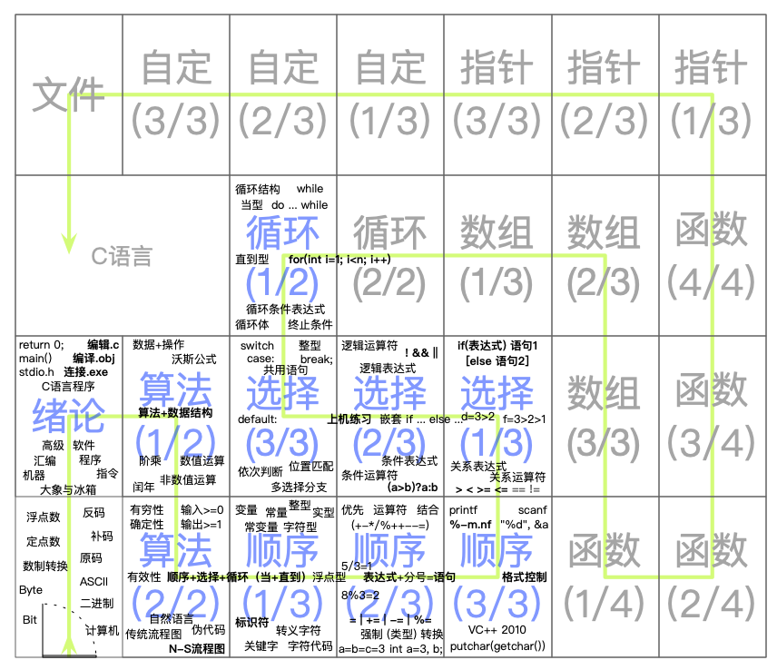-->


### 2020-03-17 雨课堂上课-C语言程序设计第五章循环（2/2）
60/61名同学签到了课程，16:05-17:40，课程2节共90分钟，中途休息5分钟。

全程雨课堂授课，起初桌面屏幕分享直播，部分同学反映画面卡顿，切换成音频直，直至结束。

全程弹幕134条，随堂小测试题9次。

课前声明，为了督促大家学习投入，请有在听课的同学如果对测试题答案感到为难，可选择E选项：我只是来看看。由此观之，长期有10名左右的同学，未能保持全程注意力的投入。

<!--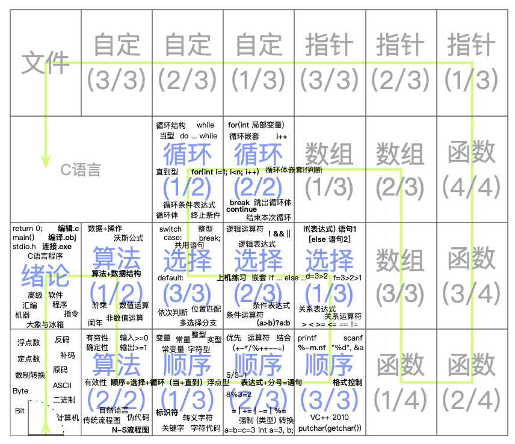-->

### 2020-03-20 雨课堂上课-C语言程序设计第一二三四五章复习课
60/61名同学签到了课程，14:00-15:40，课程2节共90分钟，中途休息5分钟。

全程雨课堂授课，稳定。

集成第一二三四五章PPT上的练习题，课上测验，题后讲解，课后作业，都围绕练习题展开。
<!---->


### 2020-03-24 雨课堂上课-C语言程序设计第六章数组（1/3）
61/61名同学签到了课程，16:05-17:40，课程2节共90分钟，中途休息5分钟。

全程雨课堂授课，稳定。
<!--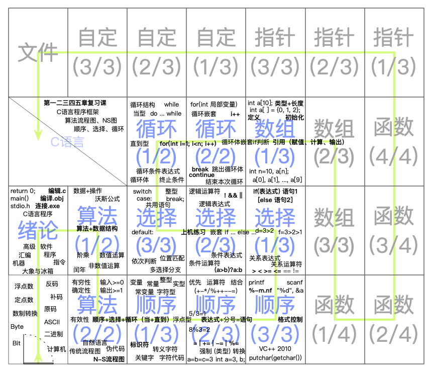-->


### 2020-03-27 雨课堂上课-C语言程序设计第六章数组（2/3）
60/61名同学签到了课程，14:00-15:40，课程2节共90分钟，中途休息5分钟。

全程雨课堂授课，稳定。

<!--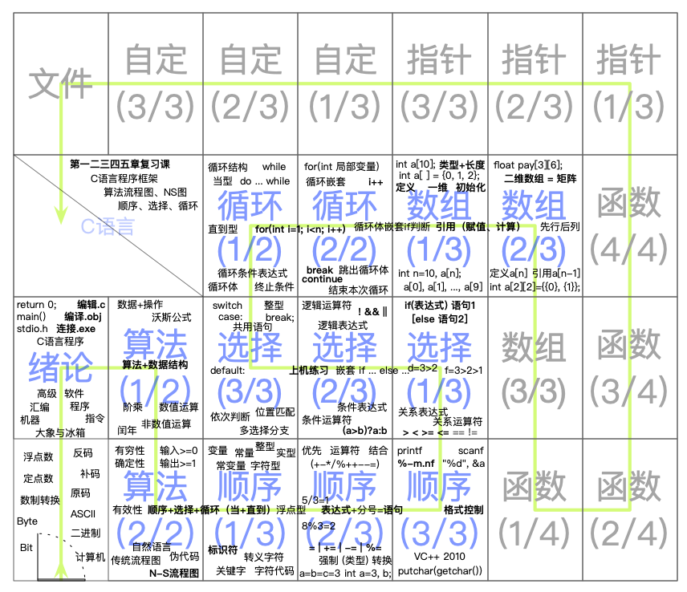-->

### 2020-03-31 雨课堂上课-C语言程序设计第六章数组（3/3）
61/61名同学签到了课程，16:05-17:40，课程2节共90分钟，中途休息5分钟。

全程雨课堂授课，稳定。

<!--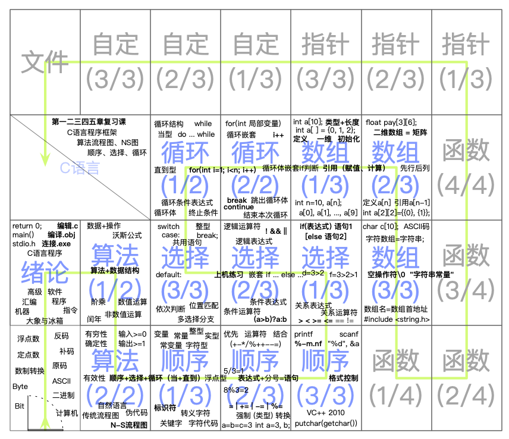-->


### 2020-04-03 雨课堂上课-C语言程序设计第七章函数（1/4）
60/61名同学签到了课程，14:00-15:40，课程2节共90分钟，中途休息5分钟。

全程雨课堂授课，稳定。

<!--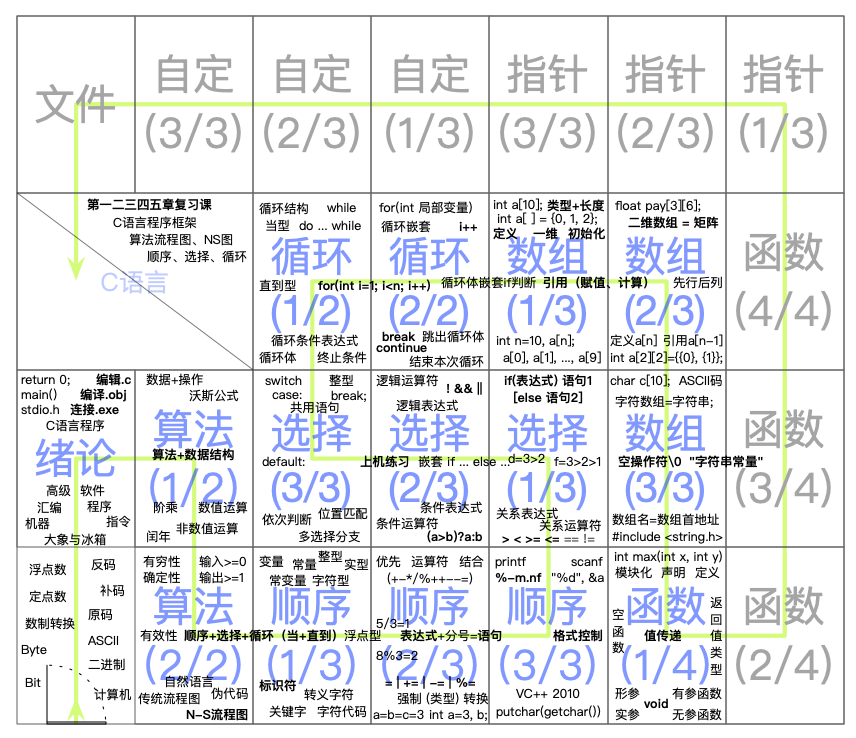-->

### 2020-04-07 雨课堂上课-C语言程序设计第七章函数（2/4）
61/61名同学签到了课程，16:05-17:40，课程2节共90分钟，中途休息5分钟。

全程雨课堂授课，稳定。

<!--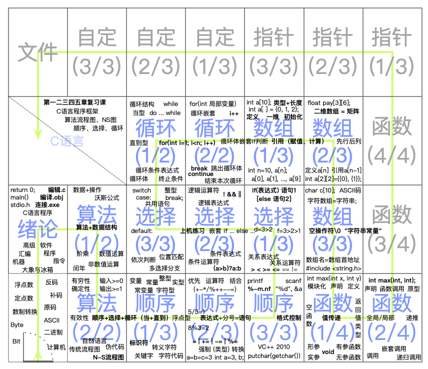-->

### 2020-04-10 雨课堂上课-C语言程序设计第七章函数（3/4）
61/61名同学签到了课程，14:00-15:40，课程2节共90分钟，中途休息5分钟。

全程雨课堂授课，稳定。

<!--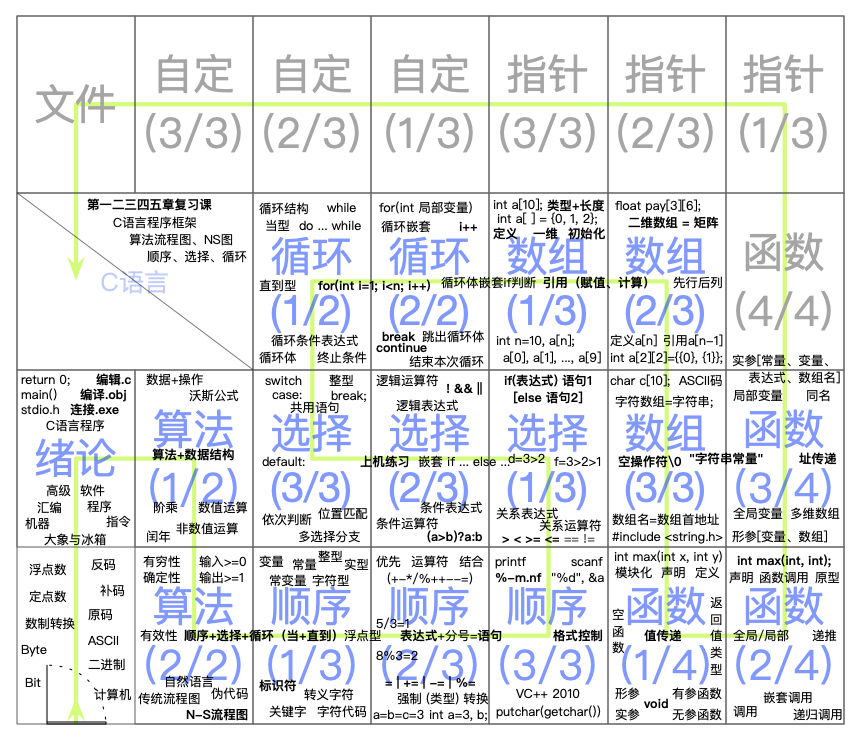-->

### 2020-04-14 雨课堂上课-C语言程序设计第七章函数（4/4）
61/61名同学签到了课程，16:05-17:40，课程2节共90分钟，中途休息5分钟。

全程雨课堂授课，稳定。

<!--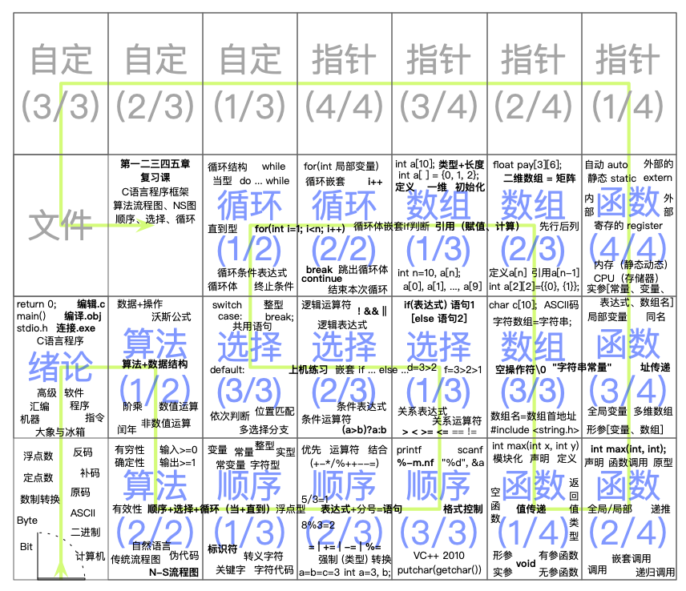-->

### 2020-04-17 雨课堂上课-C语言程序设计第八章指针（1/4）
60/61名同学签到了课程，14:00-15:40，课程2节共90分钟，中途休息5分钟。

全程雨课堂授课，稳定。

<!--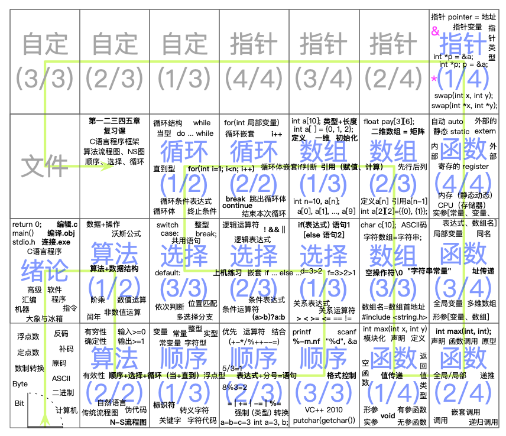-->

### 2020-04-21 雨课堂上课-C语言程序设计第八章指针（2/4）
60/61名同学签到了课程，16:05-17:40，课程2节共90分钟，中途休息5分钟。

全程雨课堂授课，稳定。

<!--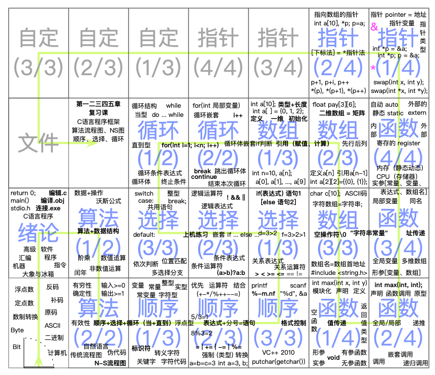-->

### 2020-04-24 雨课堂上课-C语言程序设计第八章指针（3/4）
59/61名同学签到了课程，14:00-15:40，课程2节共90分钟，中途休息5分钟。

全程雨课堂授课，稳定。

<!--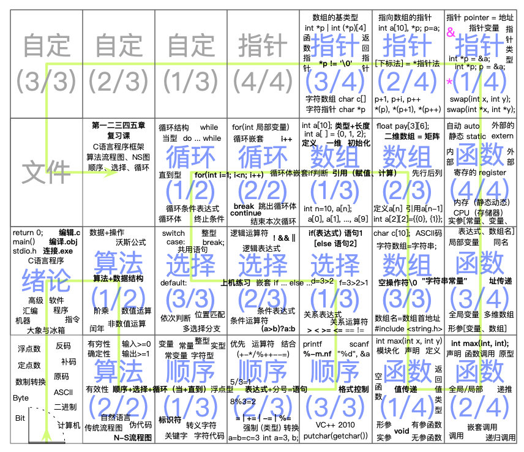-->

### 2020-04-28 雨课堂上课-C语言程序设计第八章指针（4/4）
57/61名同学签到了课程，付兴宽同学科目二请假，16:05-17:40，课程2节共90分钟，中途休息5分钟。

全程雨课堂授课，稳定。

<!--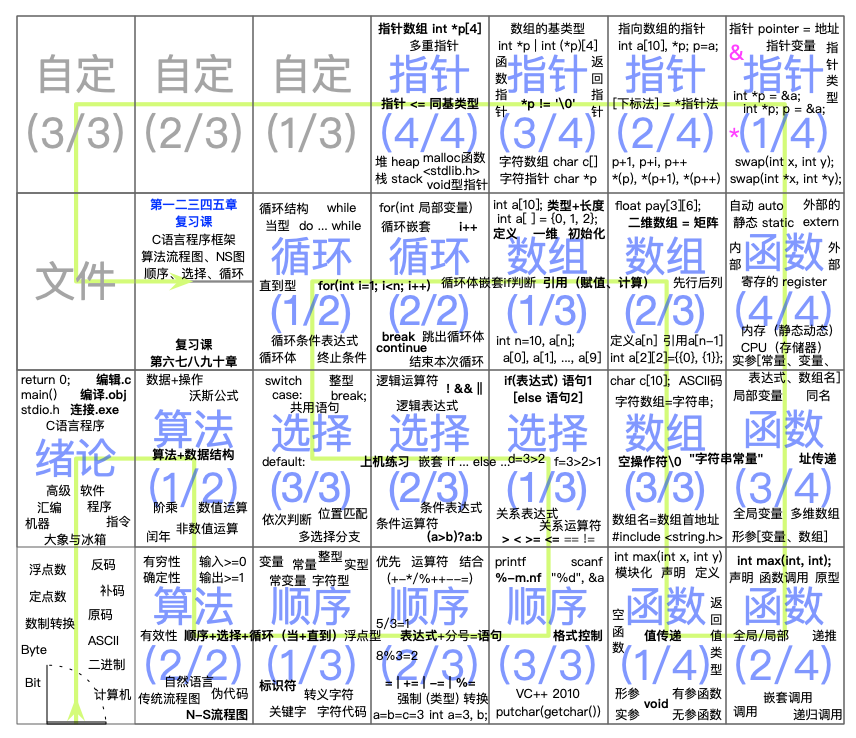-->

### 2020-05-08 雨课堂上课-C语言程序设计第九章结构体（1/3）
60/61名同学签到了课程，14:00-15:40，课程2节共90分钟，中途休息5分钟。

全程雨课堂授课，稳定。

<!--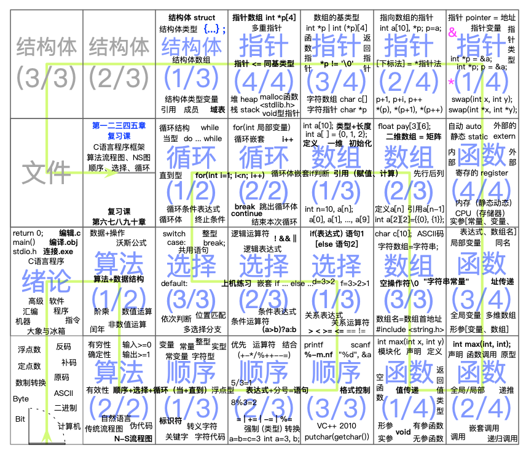-->

### 2020-05-09 雨课堂上课-C语言程序设计第九章结构体（2/3）
61/61名同学签到了课程，16:05-17:40，课程2节共90分钟，中途休息5分钟。

全程雨课堂授课，稳定。

<!--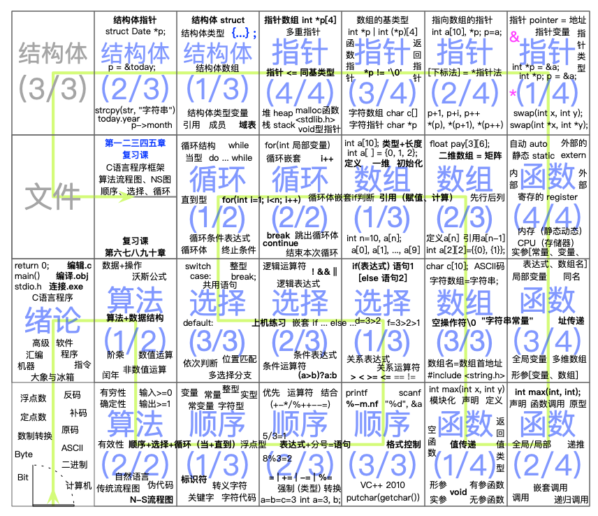-->

### 2020-05-12 雨课堂上课-C语言程序设计第九章结构体（3/3）
60/61名同学签到了课程，14:00-15:40，课程2节共90分钟，中途休息5分钟。

全程雨课堂授课，稳定。

<!--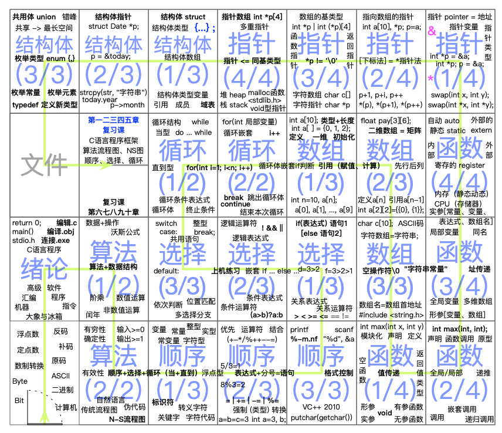-->

### 2020-05-15 雨课堂上课-C语言程序设计第十章文件（1/1）
61/61名同学签到了课程，16:05-17:40，课程2节共90分钟，中途休息5分钟。

全程雨课堂授课，稳定。

<!--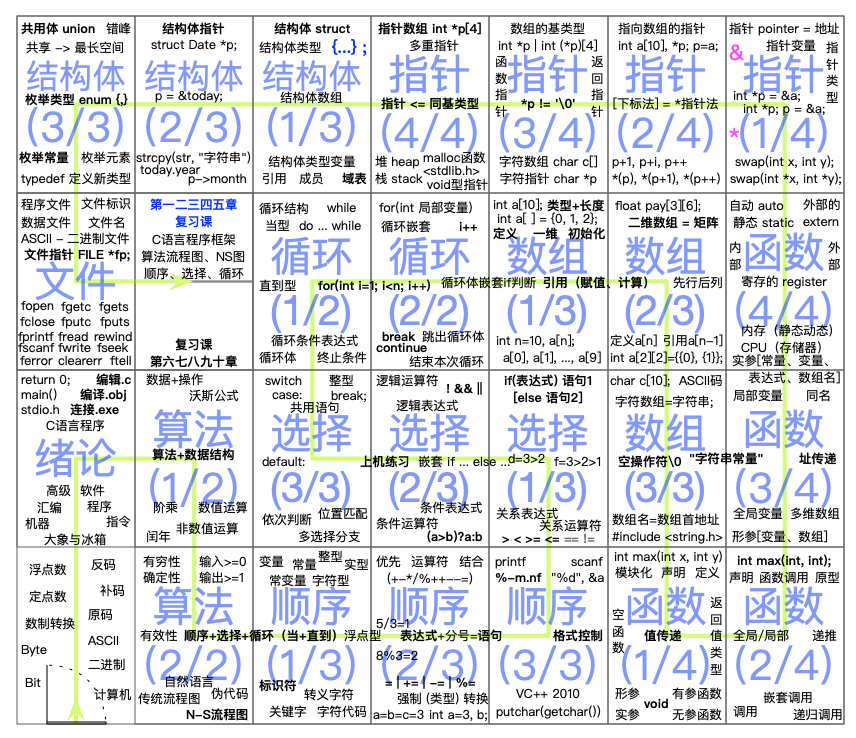-->
