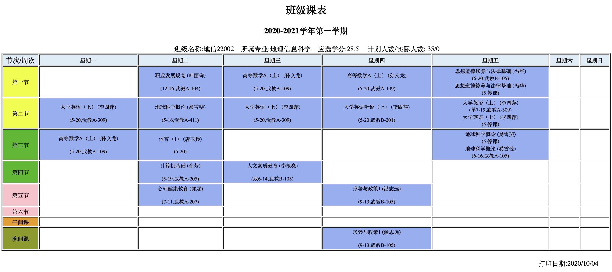
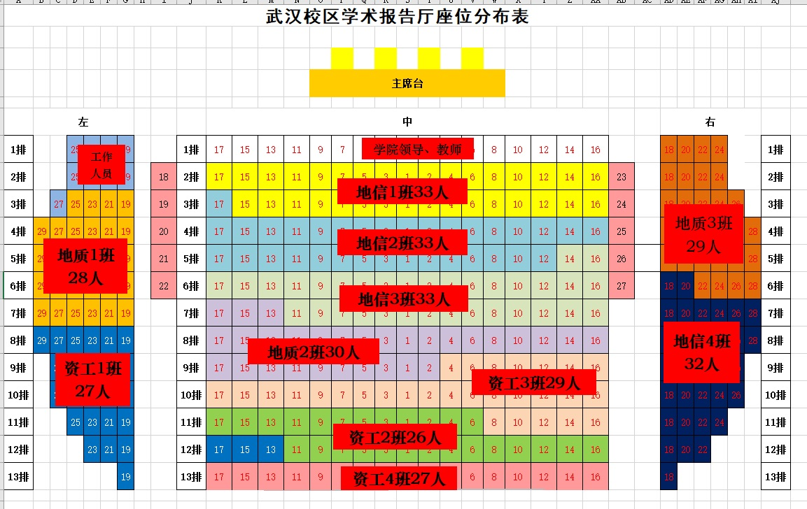
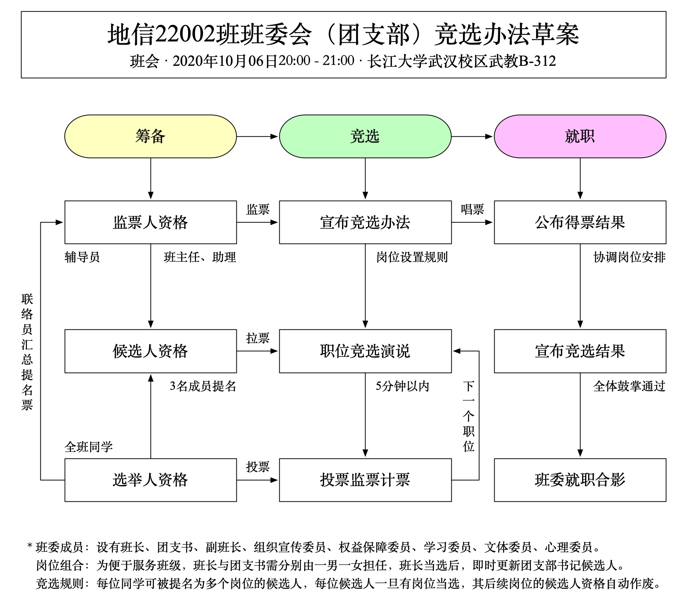
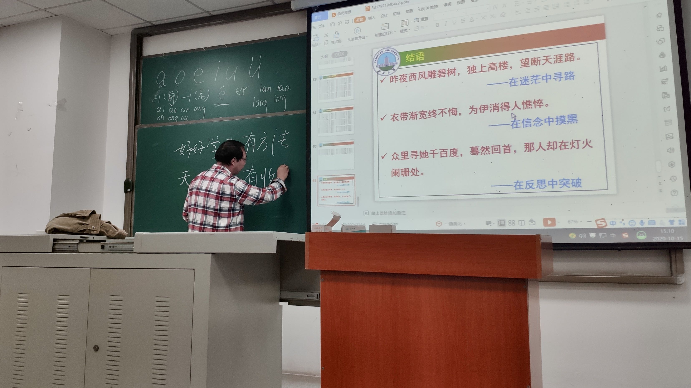
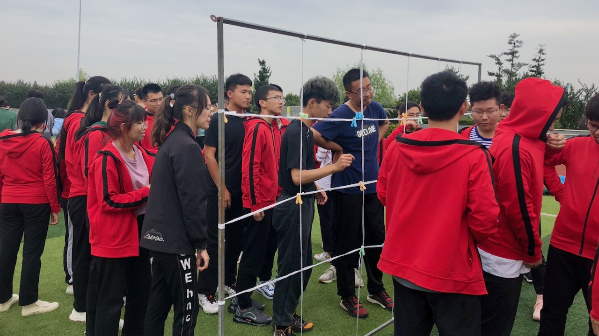

## 目录
{:.no_toc}
1. TOC
{:toc}

# 班级画册

## 20200922 一次班会

+   新生第一次班会，五湖四海齐聚一堂，互相认识之后，陶潇桐同学和李楚楚同学成为了班级联络员。

## 20201001 军训会操
+   新生军训会操，林竑川教官和他的三营一连。

+   会操结束，三营一连榜上有名，地信22002班和他们的方小地。

## 20201002 开学典礼
+   新生开学典礼，主会场设在长江大学荆州校区的大礼堂，地信2班的同学们在武汉校区的教室里云参会。

## 20201004 早晚自习
+ 大学一年级的新生们，需早晚到自习室自习，目前阶段的主要任务是面向大学英语和全国大学英语四级考试，早晚自习时间：
+ 早自习
  - 周一至周五
  - 07:00 至 07:45
+ 晚自习
  - 周日至周四
  - 19:00 至 21:00

## 20201005 开课一周
+   长江大学2020-2021学年第1学期校历第6周，同学们正式走进教室开始上课了。

## 20201006 班干部们
+   晚六点半，石油科技大楼大礼堂，举行了地球科学学院2020级本科新生开学典礼，我班即将当选的陶潇桐班长作为新生代表上台发言。

+ 晚八点地信2班第二次班会，选出第一届班委会（团支部）成员。
  - 班长（兼安全委员）：陶潇桐
  - 团支书：李楚楚
  - 副班长：王术澔
  - 组织宣传委员：符凡翕
  - 权益保障委员（兼生活委员）：方经忠
  - 学习委员：虞舒婷
  - 文体委员：张逸枫
  - 心理委员：王烨辰

## 20201015 新生导师
+ 下午两点，武教B-102，地球科学学院地信系全体老师见面会，为2020级新生介绍了GIS专业的学习方法，为每位新生分配了导师。

+ 来自地信22004班的六位同学。
  - 班浩泷
  - 陈羽杰
  - 段舜尧
  - 贺自成
  - 刘明冉
  - 刘亚男

## 20201022 篮球比赛
+ 2020年10月22日，武汉校区第三届“新生杯”篮球赛开幕，长江大学篮球协会（武）。
+ 2020年10月24日，地信22002 vs 资工21802，期待补充比赛战况和现场照片。
+ 2020年10月26日，地信22002 vs 地质22003，期待补充比赛战况和现场照片。
+ 2020年接下来的某一天，未完待续，TBD......

## 20201023 上晚自习
+ 2020年10月23日，星期五，晚19:00-21:00，长江大学武汉校区武教B312，陪大家自习。
    - 晚自习应到33人，实到33人，有学生会组织督促查验。
    - 陶潇桐小恙，以身示范坚持自习，精神可嘉。
    - 同学们多复习高等数学，想必课程内容较难，需大家多花精力应付。
    - 同学们各自复习，全程安静平和，余心甚慰。
    - 愿大家能保持学风，在课堂上也能保持风度，不看手机，专心听讲，认真笔记。

## 20201024 素质拓展
+ 2020年10月24日，星期六，长江大学武汉校区运动场，2020级新生素质拓展活动。
+ 
