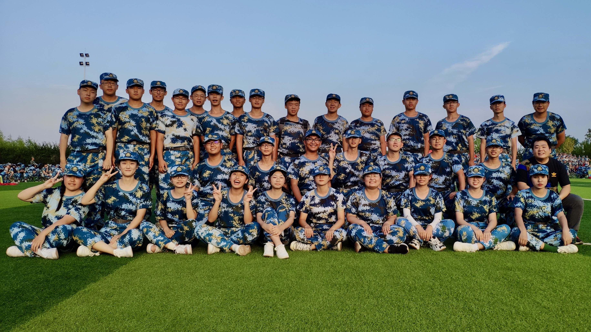

## 目录
{:.no_toc}
1. TOC
{:toc}

# 班级画册

## 20200922 一次班会

+   新生第一次班会，五湖四海齐聚一堂，互相认识之后，陶潇桐同学和李楚楚同学成为了班级联络员。

## 20201001 军训会操
+   新生军训会操，林竑川教官和他的三营一连。

+   会操结束，三营一连榜上有名，地信22002班和他们的方小地。

## 20201002 开学典礼
+   新生开学典礼，主会场设在长江大学荆州校区的大礼堂，地信2班的同学们在武汉校区的教室里云参会。

