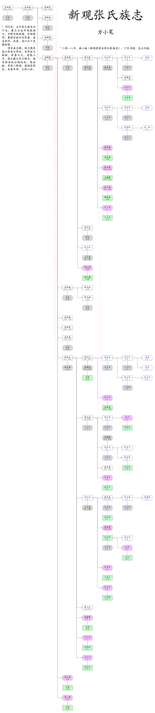

# 张氏族志

方小笔

------

## 目录
{:.no_toc}
1. TOC
{:toc}

## 家族源远
### 五千年来渊源

“天下张姓出清河”，由此道出张姓与清河的渊源。

家族世系供奉有家神牌位，冠以“清河流芳”，故本支系应属于清河堂，始于张姓始祖。

清河堂：黄帝封少昊氏于青阳（今清河县），少昊子挥为张氏始祖，后人追思清河，故有“清河堂”。

**张姓起源与弓箭有着密切关系。**

据明嘉靖年间修订的《张氏统宗世谱》载：“吾张氏得姓者，黄帝第三妃彤鱼氏生子曰挥，观弧制矢，赐姓张氏，官弓正，因封青阳。挥子昧为玄冥师。”

远古时代，我们的祖先获取食物的主要方法是渔猎和采集，猎杀工具只有棍棒和石块。黄帝部落逐渐壮大后辗转游移，到达今河北涿鹿一带定居下来。狩猎征战过程中，黄帝部落诞生了一种可以远射杀敌的工具，就是后人所称的弓箭，其发明者是黄帝第五子挥。涿鹿之战中，黄帝与蚩尤八战而不胜。关键时刻，黄帝采纳了挥用弓箭武装部族的建议，最终诛杀蚩尤，从而平定天下。之后，黄帝封挥为制造弓矢的官叫“弓正”，也称“弓长”，又将官名合二为一赐他“张”姓，封地青阳。得姓后，挥与子孙们就在涿鹿之南的古青阳（今清河一带）繁衍生息。

**张氏是一个极富开拓与进取精神的家族。**

春秋时期，张氏先人就从清河开始向诸侯各国迁徙。战国至秦末，兵祸天灾又推动了张氏先民向外迁徙的脚步。西汉统一后，人丁兴旺的张氏家族，人才辈出，极大地拓展了张氏族人的生活空间。

此后，张氏还有3次大的迁徙浪潮：
第一次是东晋至南北朝时期。张氏先民活动的中心，处于战乱之中，为求生存，他们被迫外迁。台湾屏东县《清河百忍族谱》记载：张氏祖脉在清河，后因生子众多迁入徐州，逐渐南下，一祖过扬子江，分住下塔衢州(在今浙江)、托州(在今江西)、福州、韶州、赣州等处；一祖迁入湖州(在今浙江)；一祖入演州(在今越南)。

第二次是唐安史之乱时期。为了躲避战乱，北方各地的张氏族人不断南下，散居江淮、湖广、闽浙等各地。

第三次迁徙起于北宋末年金兵南下。此次迁徙，使张氏族人向巴蜀、两淮、岭南流移。此后，张氏裔孙进一步外迁，历经数千年，已散布全球。

<!--
**十一世：张单**

挥之十一世孙张单，因发明“灶”被人称为“灶君公”。灶神，全衔是“九天东厨司命太乙元皇定福奏善天尊”，俗称“灶君”，或称“灶君公”、“司命真君”、“九天东厨司命主”、“香厨妙供天尊”或“灶王”，北方称他为“灶王爷”，鸾门尊奉为三恩主之一，也就是厨房之神。

**十二世：张天杰**

夏禹之父鲧所筑的防洪大堤——鲧堤，至今仍横卧在清河与威县交界处。鲧被杀后，禹承父志继续治水，他起用挥之十二世孙张天杰为“水正”之官，成全治水之功。

**秦末汉初：张良**

张良（约前250年—前189年），字子房，颍川城父（今河南禹州）人。秦末汉初杰出谋臣，与韩信、萧何并称为“汉初三杰”。

**东汉：张衡**

张衡（78年—139年），字平子。汉族，南阳西鄂（今河南南阳市石桥镇）人，南阳五圣之一，与司马相如、扬雄、班固并称汉赋四大家。中国东汉时期伟大的天文学家、数学家、发明家、地理学家、文学家，在东汉历任郎中、太史令、侍中、河间相等职。

**东汉末年：张仲景**

张仲景（约公元150～154年——约公元215～219年），名机，字仲景，东汉南阳涅阳县（今河南省邓州市穰东镇张寨村）人。东汉末年著名医学家，被后人尊称为医圣。张仲景广泛收集医方，写出了传世巨著《伤寒杂病论》。它确立的辨证论治原则，是中医临床的基本原则，是中医的灵魂所在。

**东汉末年：张飞**

张飞（？—221年），字益德（《华阳国志》作翼德），涿郡（今河北涿州）人，三国时期蜀汉名将。张飞勇武过人，与结拜兄弟关羽并称为“万人敌”。

**明：张居正**

张居正（1525年5月24日－1582年7月9日），字叔大，号太岳，幼名张白圭，湖广荆州卫（湖北省荆州市）军籍。生于江陵县（荆州），故称之“张江陵”。嘉靖二十六年（1547）进士。明朝政治家、改革家、内阁首辅，辅佐万历皇帝朱翊钧进行“万历新政”，史称“张居正改革”。

**清：张三甲**

张三甲，清光绪二十四年（1898）武状元，是中国科举史上最后一位武状元。
张三甲,字鼎臣,号魁轩,又名荣甲,清光绪丙子年(1876年)十月五日生于开州户部寨村,一个清贫而又尚武世家。
-->
中国大陆有张姓人口8000余万，其他地区约2000万人，因此张姓号称“亿人”之众。

### 千百年来家国

参天之树，必有其根；怀山之水，必有其源。

<html>
    <head>
    
    </head>
    <body>
    
    
    
    
    </body>
    

</html>

## 新观张氏

### 百十年来家世

